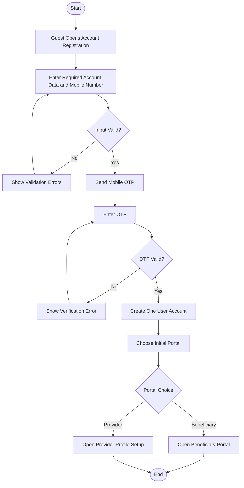

# Activity 01 — Account Registration & Initial Portal Selection

> **Status:** `REVIEW DRAFT — SYNCHRONIZED 2026-09-19 THROUGH DEC-091 — NOT BASELINED`
>
> **Basis:** DEC-077/078, BR-045/048/049, Account & Portal Model.

The created account is one User account serving both portals. Provider selection starts profile setup; it does not create a second account or automatically grant provider eligibility.
