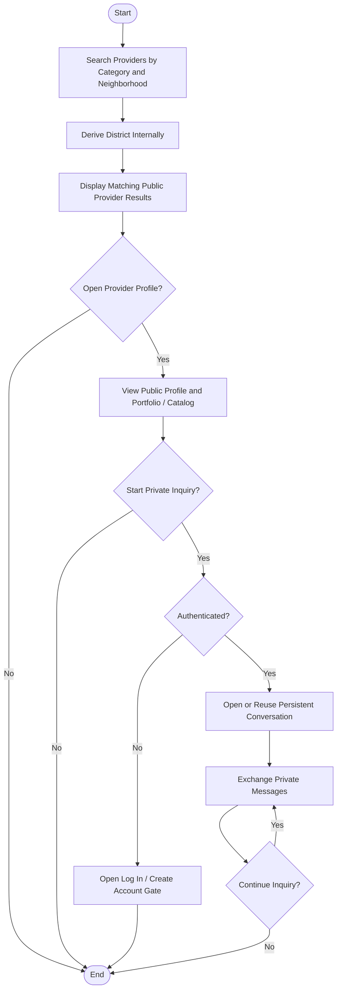

# Activity 02 — Direct Search & Inquiry

> **Status:** `REVIEW DRAFT — SYNCHRONIZED 2026-09-19 THROUGH DEC-091 — NOT BASELINED`
>
> **Basis:** UC-01, DEC-012/031..033/046/064/075/077, BR-001/005/042/044/047.

Chat alone does not create a Transaction. Public views exclude phone/direct private-contact data and sensitive records. One persistent Conversation is reused for the same Beneficiary–Provider pair.
