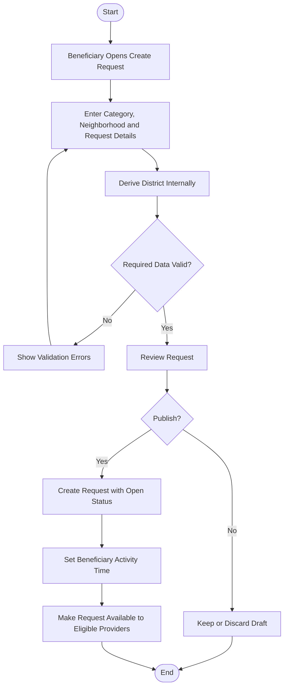

# Activity 03 — Create Request

> **Status:** `REVIEW DRAFT — SYNCHRONIZED 2026-09-19 THROUGH DEC-091 — NOT BASELINED`
>
> **Basis:** UC-02, DEC-012/013/077/081, BR-001..003/045/052/053.

Authentication is a precondition. User-facing location is Neighborhood; District is derived internally. Publication creates an Open Request, not a Transaction.
