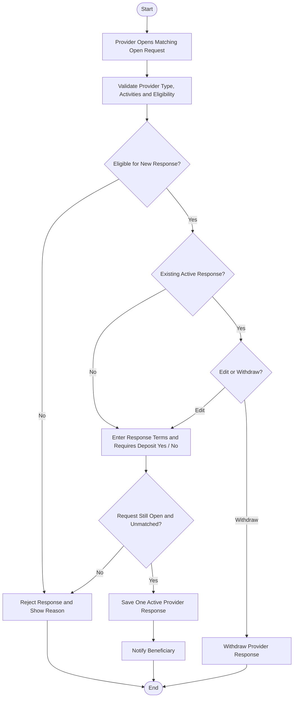

# Activity 04 — Provider Response to Request

> **Status:** `REVIEW DRAFT — SYNCHRONIZED 2026-09-19 THROUGH DEC-091 — NOT BASELINED`
>
> **Basis:** UC-03, DEC-013/041/043/070/074/076/086, BR-003/030/033/039/041/043/062.

There is at most one active response per Provider per Request. Edit/withdraw is allowed only while the Request is Open and before selection. `RequiresDeposit` is a boolean only; YADD does not process payment.
