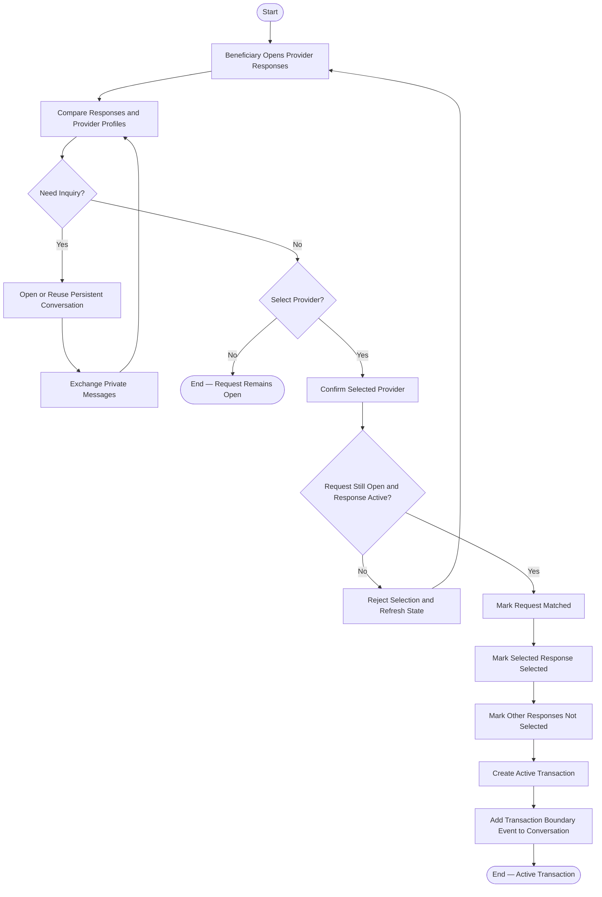

# Activity 05 — Select Provider from Request

> **Status:** `REVIEW DRAFT — SYNCHRONIZED 2026-09-19 THROUGH DEC-091 — NOT BASELINED`
>
> **Basis:** UC-04, DEC-014/046/047/066/075, BR-004..006/042.

Selection closes the Request to new responses and creates one Active Transaction. Inquiry/chat alone never creates a Transaction.
