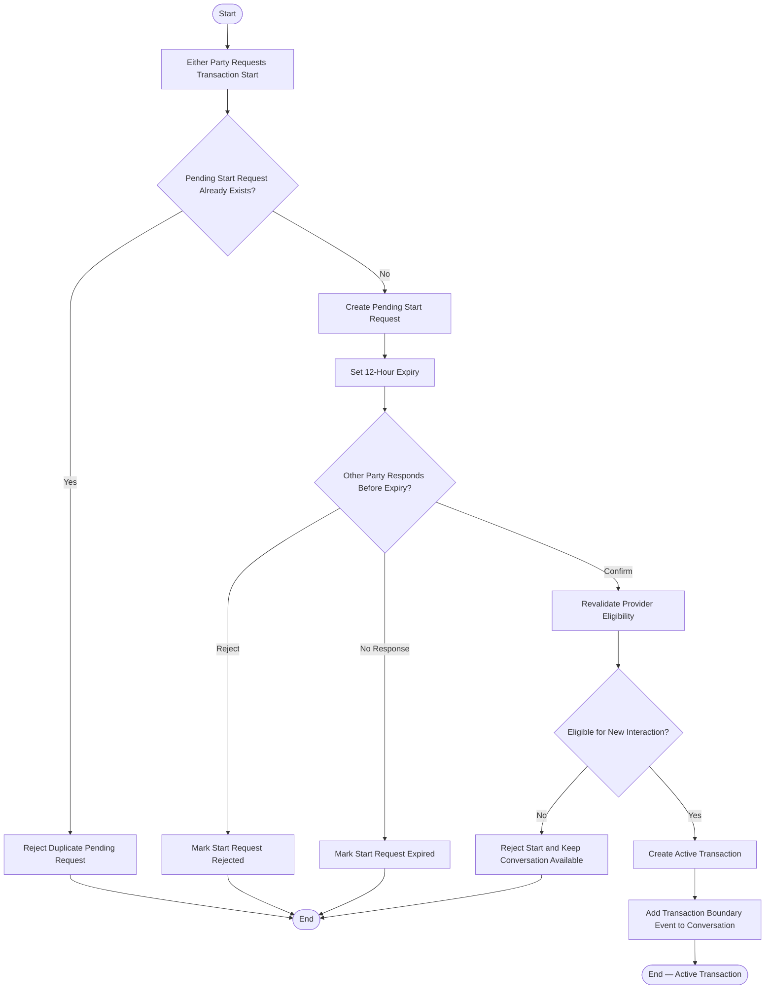

# Activity 06 — Direct Transaction Start

> **Status:** `REVIEW DRAFT — SYNCHRONIZED 2026-09-19 THROUGH DEC-091 — NOT BASELINED`
>
> **Basis:** UC-01 direct-start alternative, DEC-046/069/075/082/086, BR-007/037/042/062.

Confirmation and current Provider eligibility are both required. Rejection/expiry affects only the start request; the persistent Conversation remains available.
