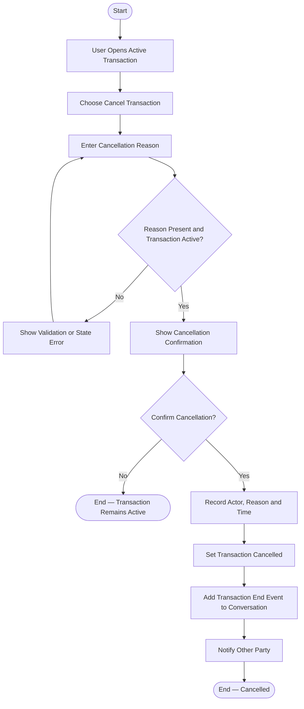

# Activity 07 — Cancel Transaction

> **Status:** `REVIEW DRAFT — SYNCHRONIZED 2026-09-19 THROUGH DEC-091 — NOT BASELINED`
>
> **Basis:** UC-05, DEC-056/075, BR-023, Request Closure/Cancellation/Expiry Model.

Cancellation applies after Transaction start and is distinct from closing an Open Request. Cancelled Transactions do not permit invoice completion or ratings.
