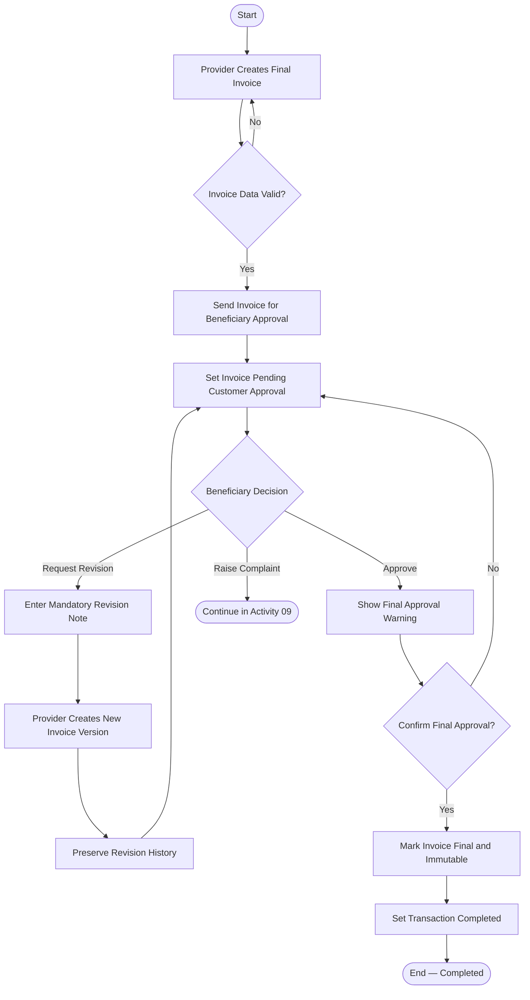

# Activity 08 — Final Invoice, Revision & Approval

> **Status:** `REVIEW DRAFT — SYNCHRONIZED 2026-09-19 THROUGH DEC-091 — NOT BASELINED`
>
> **Basis:** UC-06, DEC-015/025/050/071/083, BR-009..013/057/058, Invoice Approval & Dispute Model.

No response is not approval. The pending invoice receives reminders at 24h and 48h and becomes Overdue at 72h without Auto-Approval. Revision has no hard maximum; every revision request requires a note.
