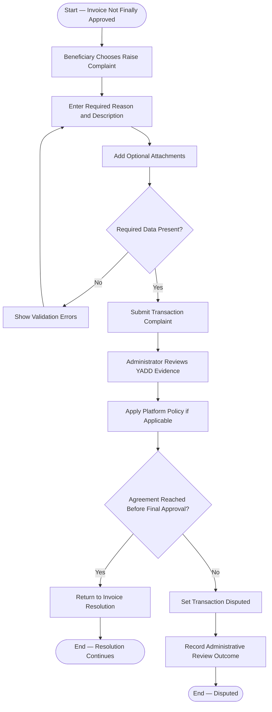

# Activity 09 — Transaction Complaint

> **Status:** `REVIEW DRAFT — SYNCHRONIZED 2026-09-19 THROUGH DEC-091 — NOT BASELINED`
>
> **Basis:** UC-06 dispute alternative, DEC-073/084, BR-040/059, Invoice Approval & Dispute Model.

A Complaint does not automatically set `Disputed`. Administration reviews platform evidence and policy only; it does not decide payment, refund, compensation, or external commercial entitlement.
