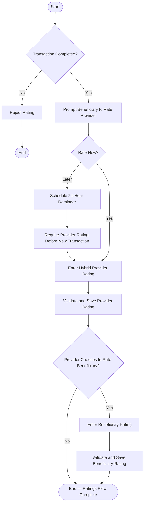

# Activity 10 — Post-Transaction Ratings

> **Status:** `REVIEW DRAFT — SYNCHRONIZED 2026-09-19 THROUGH DEC-091 — NOT BASELINED`
>
> **Basis:** UC-07/07B, DEC-051/063/087, BR-015/016/063/064, Rating & Reputation Model.

Provider rating by the Beneficiary is required with a Later option and approved reminder rule; Provider-to-Beneficiary rating is optional. Ratings never change the Completed status and are unavailable for Cancelled or Disputed Transactions.
