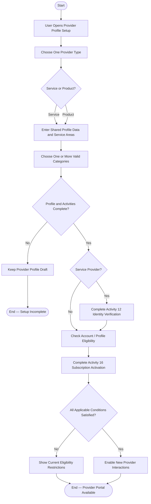

# Activity 11 — Provider Onboarding & Eligibility

> **Status:** `REVIEW DRAFT — SYNCHRONIZED 2026-09-19 THROUGH DEC-091 — NOT BASELINED`
>
> **Basis:** DEC-010/030/043/074/076/080/085/086, BR-030/041/043/051/060/062, Provider Activity Model.

One Provider Profile has exactly one type in MVP. Draft may temporarily have no Category, but provider-function eligibility requires at least one valid Category. Product Providers do not perform government-ID verification; both types require an Active Subscription for new interactions.
