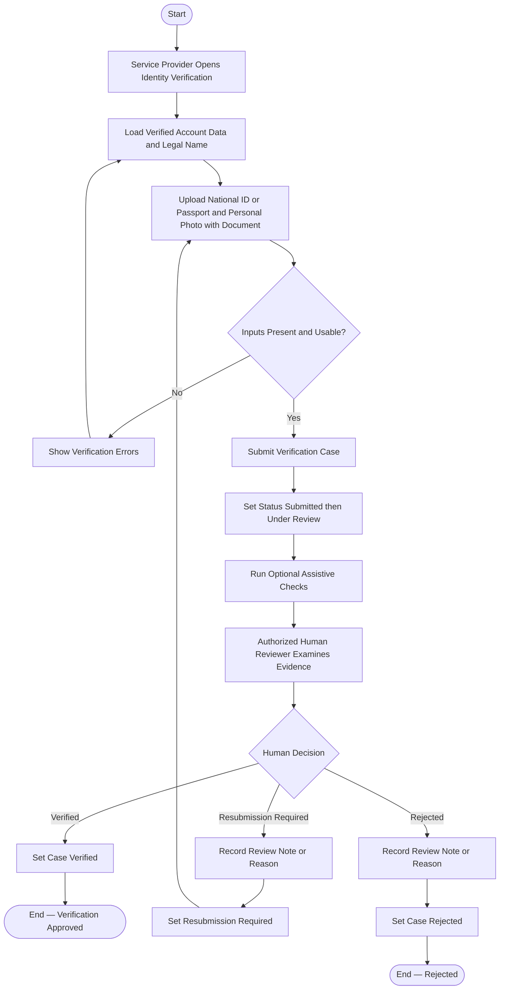

# Activity 12 — Service Provider Identity Verification

> **Status:** `REVIEW DRAFT — SYNCHRONIZED 2026-09-19 THROUGH DEC-091 — NOT BASELINED`
>
> **Basis:** UC-09, DEC-010/035..040/085, BR-060/061, Provider Verification Model.

Automated checks are advisory; the final decision is human. Verification data is private and access-controlled. Verification satisfies only the identity condition, not every Provider eligibility condition.
