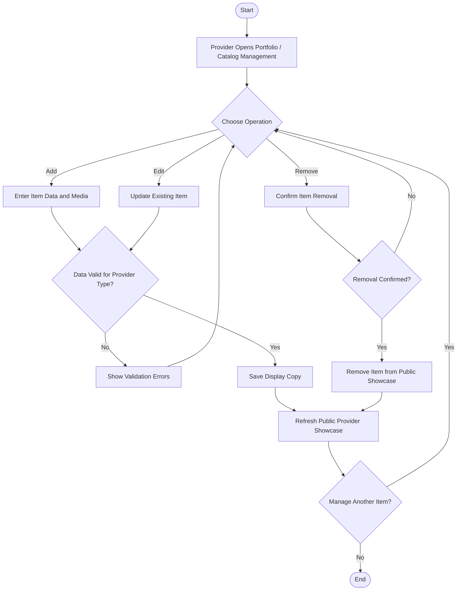

# Activity 13 — Manage Portfolio / Catalog

> **Status:** `REVIEW DRAFT — SYNCHRONIZED 2026-09-19 THROUGH DEC-091 — NOT BASELINED`
>
> **Basis:** UC-10, DEC-064/074/077, BR-035/036/041/044, Provider Activity Model.

Service Providers manage Portfolio items; Product Providers manage Catalog items. Public display copies expose only approved public fields and do not expose private account, verification, subscription, transaction, or report data.
