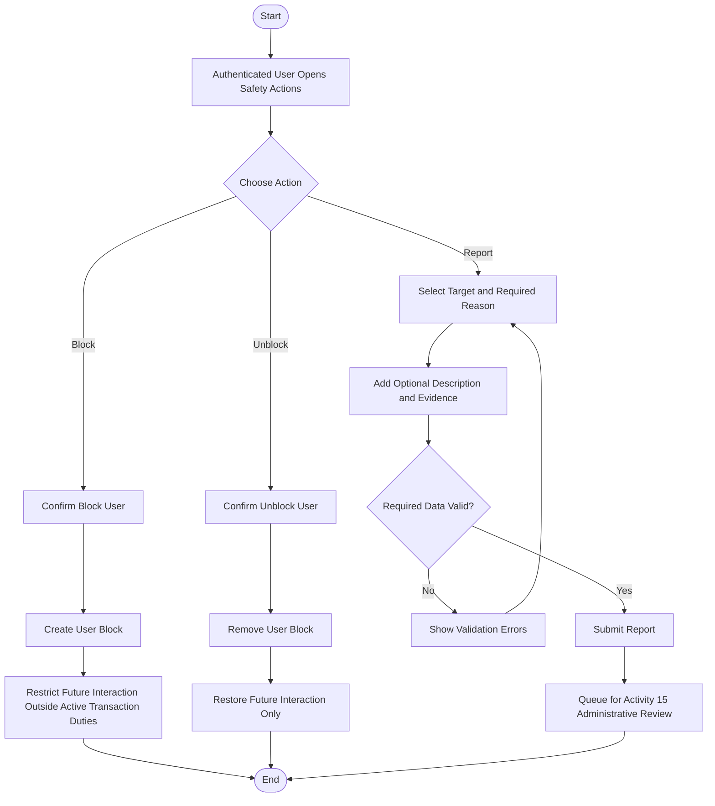

# Activity 14 — Block / Unblock & Report

> **Status:** `REVIEW DRAFT — SYNCHRONIZED 2026-09-19 THROUGH DEC-091 — NOT BASELINED`
>
> **Basis:** UC-08, DEC-053/054/075/077/088, BR-021/022/065, In-App Communication and Trust & Safety models.

Block/Unblock and Report are independent actions. Blocking does not cancel an Active Transaction. Unblock does not reopen ended Requests/Transactions or cancel a prior Report. Generic Report requires a Reason; Description is not universally mandatory.
