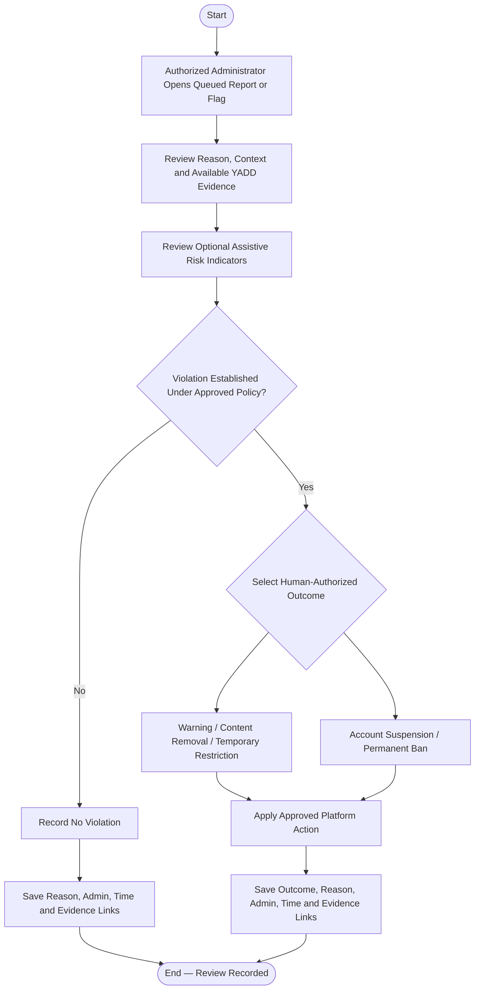

# Activity 15 — Administrative Report Review

> **Status:** `REVIEW DRAFT — SYNCHRONIZED 2026-09-19 THROUGH DEC-091 — NOT BASELINED`
>
> **Basis:** UC-08, DEC-053/054/088/089, BR-021/022/066, AI Trust & Safety Model.

A Report or AI/behavioral Flag is not proof of a violation. High-impact outcomes require human authorization. No numeric AI threshold or universal Temporary Restriction duration is invented here.
