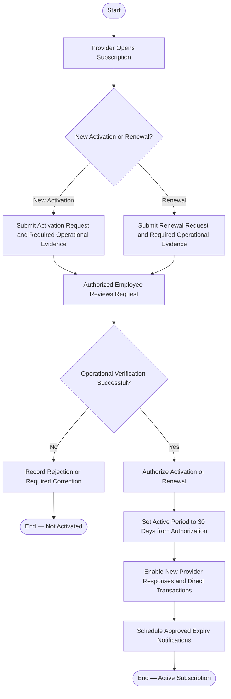

# Activity 16 — Provider Subscription & Renewal

> **Status:** `REVIEW DRAFT — SYNCHRONIZED 2026-09-19 THROUGH DEC-091 — NOT BASELINED`
>
> **Basis:** DEC-042/043/086/090, BR-062/067, Provider Subscription Model.

Activation/renewal is manually confirmed by an authorized employee after external operational verification. YADD does not process a Beneficiary–Provider payment. Expiry preserves login, Provider Portal, and existing Active Transactions, but blocks new Provider Responses and new Direct Search Transactions. Public-search visibility while expired remains open and is not inferred.
