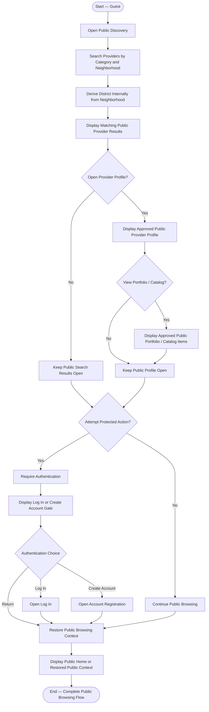

# Activity 17 — Guest Public Browsing & Protected Action Gate

> **Status:** `REVIEW DRAFT — SYNCHRONIZED 2026-09-20 THROUGH DEC-091 — NOT BASELINED`
>
> **Basis:** DEC-077/031, FR-GST-01..06, FR-003, UC-00, PUB-01..06.

Guest is an unauthenticated actor, not a stored account or separate domain entity. Public information excludes phone/direct private-contact data, identity-verification evidence, subscription internals, Transactions, Reports and other private account data. Protected actions include creating a Request, starting private Chat or a Transaction, submitting a Rating, Blocking a User and submitting a Report. Backend/API authorization is the security boundary; a UI redirect alone is not sufficient. Exact continuation to the originally intended protected action after Authentication remains intentionally unspecified, so the flow restores public-browsing context without inventing that behavior.
