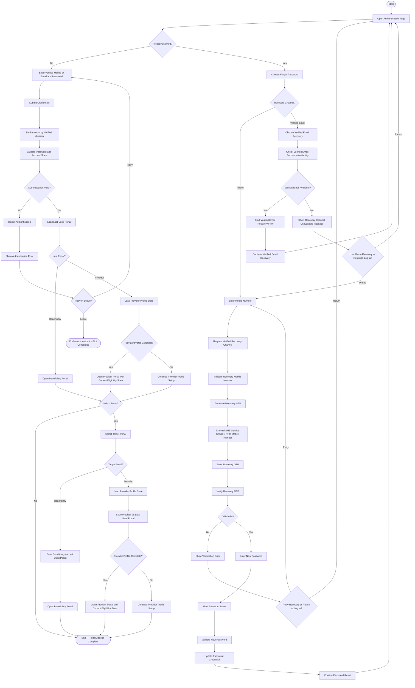

# Activity 18 — Authentication & Portal Access

> **Status:** `REVIEW DRAFT — SYNCHRONIZED 2026-09-20 THROUGH DEC-091 — NOT BASELINED`
>
> **Basis:** DEC-008..011/078/079/080/085/086, FR-001C..001F, Account & Portal Model, AUTH-01/04/05.

One User account serves both portals; portal switching does not mean logging into another account. Provider Portal access is separate from eligibility to start new Provider interactions. An Expired Subscription may restrict new interactions, but it does not remove Provider Portal access. The verified-email recovery branch is represented only at the approved level and does not invent an unfrozen implementation mechanism.
