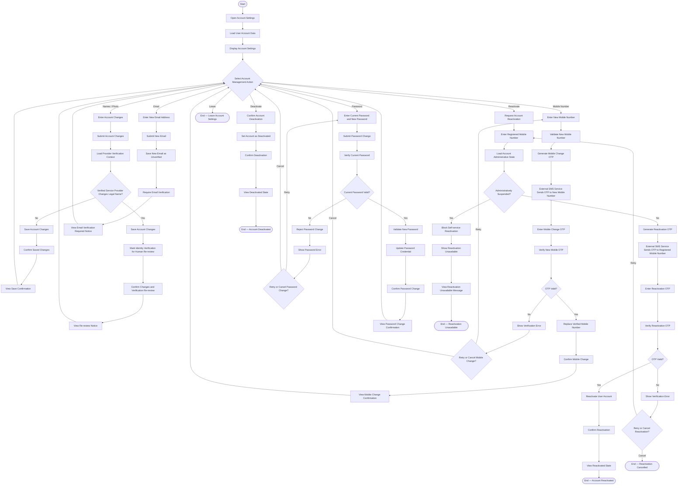

# Activity 19 — Manage Account, Deactivation & Reactivation

> **Status:** `REVIEW DRAFT — SYNCHRONIZED 2026-09-20 THROUGH DEC-091 — NOT BASELINED`
>
> **Basis:** DEC-079, FR-001G/001H, BR-050, Account & Portal Model, AUTH-06.

Product Trade Name belongs to the Provider Profile, not the User Account. A newly entered email remains Unverified and cannot be used for login or recovery until verification succeeds; the exact email-verification mechanism is not frozen here. MVP supports Deactivation and Reactivation, not self-service permanent Hard Delete. Historical Transactions, Invoices, Ratings and Reports remain retained according to the current model. Administratively suspended accounts cannot use self-service Reactivation.
