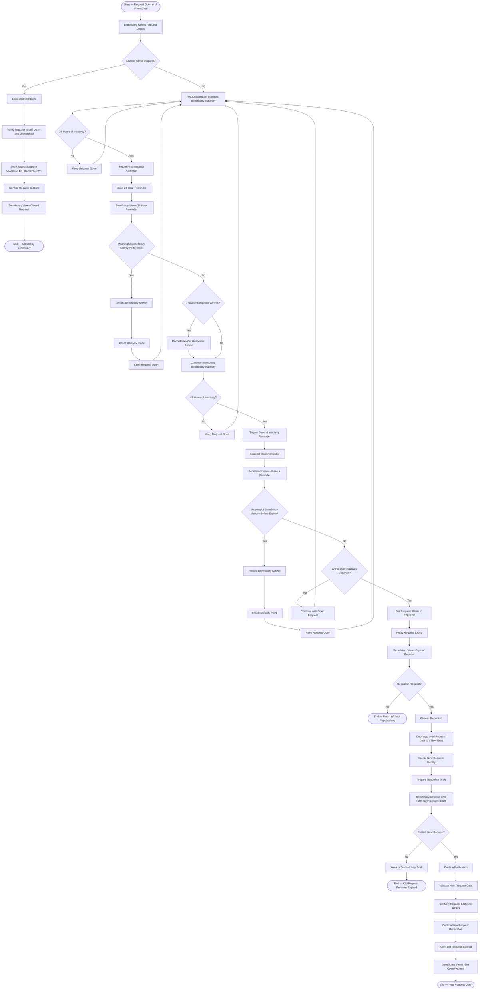

# Activity 20 — Open Request Closure, Inactivity, Expiry & Republish

> **Status:** `REVIEW DRAFT — SYNCHRONIZED 2026-09-20 THROUGH DEC-091 — NOT BASELINED`
>
> **Basis:** DEC-048/081, FR-005C..005F, BR-018/020/052/053, Request Lifecycle and Request Cancellation/Expiry Model, BEN-02/04.

Closing an Open Request is not Transaction cancellation. Meaningful Beneficiary activity resets the inactivity clock; a Provider Response arrival alone does not. Reminders occur after 24 and 48 hours of Beneficiary inactivity, and the Request becomes `EXPIRED` after 72 hours if inactivity continues. Republish never reopens the old Expired Request: old responses remain inactive, while the republished Request receives a new identity and editable copied data. The scheduler represents the approved timing policy and does not mandate a specific background-service architecture.
