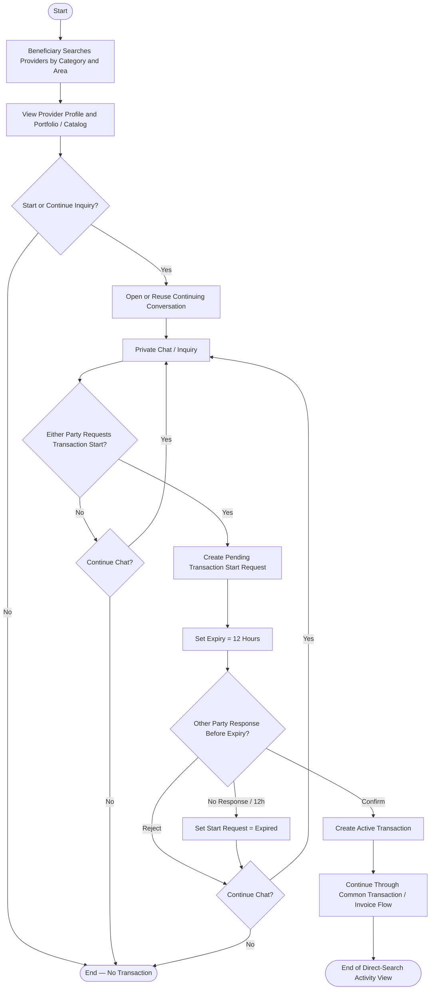

# Activity Diagram — Direct Search Route

> **Status:** `REVIEW DRAFT — NOT BASELINED — SYNCHRONIZED 2026-09-18 THROUGH DEC-082`
>
> **Type:** Derived workflow view based on `UC-01 — Search and Inquire Directly` and the approved direct-start rules.

## Source basis

- `UC-01 — Search and Inquire Directly`
- `DEC-012`, `DEC-031..033`, `DEC-046`, `DEC-047`, `DEC-064`, `DEC-066`, `DEC-069`, `DEC-075`, `DEC-082`
- Current communication and Transaction-start business rules.

## Diagram

## Semantic constraints

- بين نفس Beneficiary ونفس Provider توجد Conversation واحدة مستمرة وفق DEC-075؛ إذا كانت موجودة يعاد استخدامها، وإذا لم تكن موجودة تُفتح Conversation جديدة.
- Private Chat by itself never creates a Transaction.
- Either Beneficiary or Provider may request Transaction Start.
- `Active Transaction` is created only after the other party confirms within 12 hours.
- Only one Pending Transaction Start Request may exist between the pair at a time.
- Rejection or 12-hour expiry cancels only the start request; the continuing Conversation remains available and a new start request may be sent later.
- There is no standalone `Agreement` entity/form in this route.
- تمثيل حدود Transactions داخل Conversation المستمرة وربط Message/System Event بمعاملة محددة يبقى ضمن Chapter Four ولا يحسمه هذا Activity Diagram.

## Scope boundary

Cancellation, Final Invoice, Complaint, Completion and Ratings are intentionally represented in their common downstream workflows rather than duplicated here.
