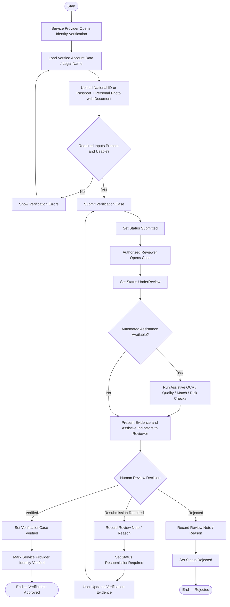

# Activity Diagram — Service Provider Identity Verification

> **Status:** `REVIEW DRAFT — NOT BASELINED — SYNCHRONIZED 2026-09-18 THROUGH DEC-090`
>
> **Type:** Derived workflow view focused on the verification portion of `UC-09 — Service Provider Identity Verification / Provider Portal Eligibility`.

## Source basis

- `UC-09 — Service Provider Identity Verification / Provider Portal Eligibility`
- `DEC-010`, `DEC-035`, `DEC-036`, `DEC-037..040`, `DEC-085`
- Current verification business rules
- `docs/03-analysis/21-provider-verification-model.md`
- Current Verification lifecycle.

## Diagram

## Product Provider boundary

Product Provider does not enter this Government-ID flow in MVP; it uses Account Verification + Provider Profile eligibility + Active Subscription and must not be labeled Identity Verified.

## Semantic constraints

- Uploading documents does not activate Provider Profile automatically.
- Final `Verified`, `ResubmissionRequired`, or `Rejected` decision is human and must come from an authorized reviewer.
- Automated checks are advisory only and do not make the final verification decision.
- `Verified` satisfies the verification condition only; it does not by itself mean that every Provider eligibility or activation condition has been fulfilled.
- Provider permissions remain subject to the other applicable conditions defined elsewhere in the project model.
- Before `Verified`, the account may continue as Beneficiary but cannot use Provider functions that require verification.
- Sensitive verification data is non-public and access-controlled.
- Accepted MVP document types are National ID or Passport; retention periods and profession-specific licenses remain open.

## Presentation note

هذا Activity Diagram يركز على lifecycle وdecision logic للتحقق فقط. نجاح التحقق لا يساوي تلقائيًا اكتمال جميع شروط أهلية Provider، كما أن تفاصيل Provider Profile editing أو subscription ليست جزءًا من مسار التحقق نفسه.
