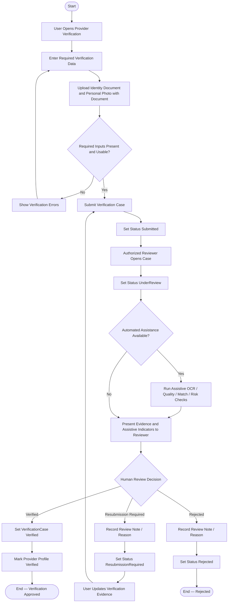

# Activity Diagram — Provider Verification

> **Status:** `REVIEW DRAFT — NOT BASELINED — SYNCHRONIZED 2026-09-12`
>
> **Type:** Derived workflow view focused on the verification portion of `UC-09 — Provider Verification / Portal Activation`.

## Source basis

- `UC-09 — Provider Verification / Portal Activation`
- `DEC-010`, `DEC-034`, `DEC-035`, `DEC-036`, `DEC-037..040`
- Current verification business rules
- `docs/03-analysis/21-provider-verification-model.md`
- Current Verification lifecycle.

## Diagram

## Semantic constraints

- Uploading documents does not activate Provider Profile automatically.
- Final `Verified`, `ResubmissionRequired`, or `Rejected` decision is human and must come from an authorized reviewer.
- Automated checks are advisory only and do not make the final verification decision.
- `Verified` satisfies the verification condition only; it does not by itself mean that every Provider eligibility or activation condition has been fulfilled.
- Provider permissions remain subject to the other applicable conditions defined elsewhere in the project model.
- Before `Verified`, the account may continue as Beneficiary but cannot use Provider functions that require verification.
- Sensitive verification data is non-public and access-controlled.
- Exact accepted document types, retention periods, and profession-specific licenses remain open and are not invented here.

## Presentation note

هذا Activity Diagram يركز على lifecycle وdecision logic للتحقق فقط. نجاح التحقق لا يساوي تلقائيًا اكتمال جميع شروط أهلية Provider، كما أن تفاصيل Provider Profile editing أو subscription ليست جزءًا من مسار التحقق نفسه.
