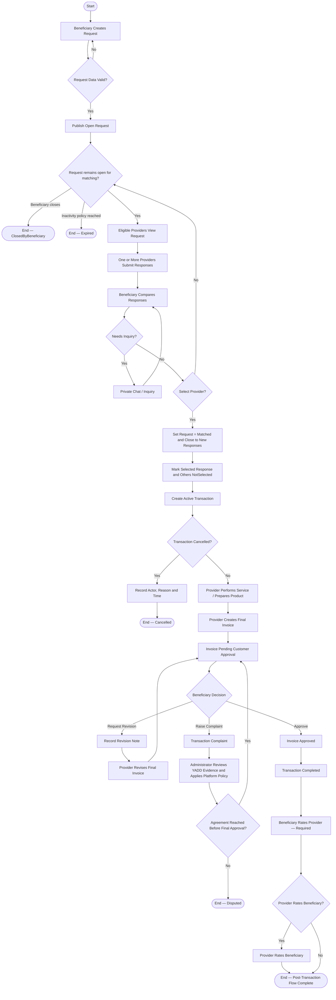

# Activity Diagram — Published Request Route

> **Status:** `REVIEW DRAFT — NOT BASELINED`
>
> **Type:** Derived workflow view. هذا المخطط لا ينشئ Requirement أو Use Case جديدة؛ يجمع المسار الرئيسي من `Create Request` حتى نهاية Transaction الناجحة/غير الناجحة لعرض القرارات الأساسية بصورة واحدة.

## Source basis

- `UC-02 — Create Request`
- `UC-03 — Respond to Request`
- `UC-04 — Select Provider from Request`
- `UC-05 — Cancel Active Transaction`
- `UC-06 — Create, Revise and Approve Final Invoice`
- `UC-07 / UC-07B — Post-Transaction Ratings`
- `DEC-047/048/049/050/051/063/066/068/070/071/073`
- Current Business Rules and Request/Transaction/Invoice lifecycles.

## Diagram

## Semantic constraints

- Chat alone does not create a Transaction.
- Request Route creates `Active Transaction` only after Provider selection.
- عند اختيار Provider ينتقل Request من `Open` إلى `Matched`; يعني ذلك توقفه عن استقبال Responses جديدة وبدء المعاملة الرسمية مع Provider المختار.
- Beneficiary may close an `Open` Request before selection; this is `Request Closure`, not `Transaction Cancellation`.
- Request expiry is represented conceptually only. Exact inactivity duration and reminder timing remain open and are not invented here.
- Final Invoice approval makes Transaction `Completed`.
- Complaint does not automatically make Transaction `Disputed`; `Disputed` occurs only when disagreement remains unresolved without agreement before final approval.
- Ratings open only after `Completed` and do not change Transaction status.
- No Payment/Refund/Escrow lifecycle exists inside YADD.

## Presentation note

هذا مخطط Route-Level وليس Activity لكل Use Case. الهدف إظهار workflow العام والقرارات الرئيسية دون تكرار مخططات UC الفردية.
