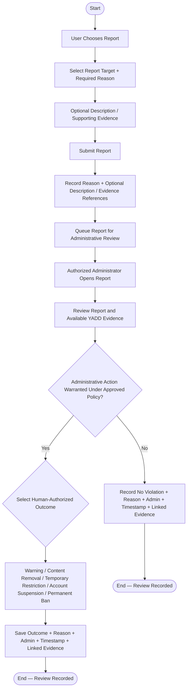

# Activity Diagram — Report and Administrative Review

> **Status:** `REVIEW DRAFT — NOT BASELINED — SYNCHRONIZED 2026-09-18 THROUGH DEC-090`
>
> **Type:** Derived workflow view focused on the Report branch of `UC-08 — Block and Report User / Content`.

## Source basis

- `UC-08 — Block and Report User / Content`
- `DEC-053`, `DEC-054`, `DEC-089`
- `BR-021`, `BR-022`, `BR-066`
- Current Trust & Safety / moderation rules and traceability.

## Diagram

## Semantic constraints

- `Block User` is independent from `Report User / Content`; one does not require the other.
- Generic Report requires a Reason; Description is not universally mandatory and remains policy/context dependent. Supporting evidence may be optional when supported by the context.
- A Report is not proof of a violation and does not automatically justify a final punishment.
- Administrative action must follow approved YADD policy and human authorization.
- AI or behavioral Flags may support review elsewhere in Trust & Safety, but this Activity Diagram does not make AI a mandatory step for every Report.
- Generic Report requires a Reason. Generic Description is not made universally mandatory; it remains context/policy-dependent. Transaction Complaint has its separate required Reason + Description rule.
- No numeric risk threshold or automatic punishment is invented here. The approved outcome catalog is: No Violation, Warning, Content Removal, Temporary Restriction, Account Suspension, Permanent Ban; high-impact outcomes require human authorization.
- Temporary Restriction duration is not hard-coded here; it follows the applicable approved operational policy.
- A Temporary Restriction duration follows the applicable approved policy; no universal duration is hard-coded.

## Scope boundary

This diagram does not model Transaction Complaint from UC-06. Transaction Complaint has its own workflow because its semantics and `Disputed` outcome are different from generic User / Content reporting.
