# Class Diagram — Integrated Master View

> **Status:** `SEMANTICALLY VERIFIED — TEAM APPROVED — NOT BASELINED — VISUAL/A4 FINALIZATION PENDING`
>
> **Type:** Integrated Master View of the same Detailed Analysis Class Model represented by Views 1–3.

## Purpose

هذا الملف لا يمثل Class Model رابعًا مستقلًا. هو **Master Integration View** يجمع نفس الـAnalysis Classes الموجودة في الـViews الثلاثة في رسم واحد بعد إزالة التكرار، لإثبات أن الحزمة كلها نموذج Class واحد متكامل.

- عدد الـClasses الفريدة في الـMaster: **26**.
- لا يضيف هذا الـView أي علاقة دلالية جديدة غير موجودة في Views 1–3.
- الـClasses التي كانت تظهر في أكثر من View مثل `User`, `ProviderProfile`, `Request`, `ProviderResponse`, `Conversation`, `ShowcaseItem`, و`Transaction` تظهر هنا مرة واحدة فقط بعد جمع تفاصيلها المتوافقة.
- هذا الـMaster يثبت التكامل والحدود بين المجالات، بينما تبقى Views 1–3 هي العرض الأكثر قابلية للقراءة عند مناقشة التفاصيل والطباعة على A4.

## Source basis

- `01-account-provider-discovery.md`
- `02-transaction-invoice-ratings.md`
- `03-verification-subscription-trust.md`
- مصادر التحليل الحاكمة المشار إليها داخل كل View، مع أولوية Decision Register ثم SRS/Business Rules/Lifecycles/Use Cases/ERD عند أي تعارض.

## Integrated diagram

```mermaid
classDiagram
    direction TB

    class User {
        -Identifier userId
        -String fullName
        -String phone
        -String accountStatus
        +createRequest() Request
        +createProviderProfile() ProviderProfile
        +blockUser()
        +submitReport() Report
    }

    class ProviderProfile {
        -Identifier providerProfileId
        -String providerType
        -String verificationStatus
        -String profileStatus
        +selectProviderType(type)
        +addActivity(category)
        +setServiceAreas(areas)
        +addShowcaseItem()
    }

    class ProviderActivity {
        -Identifier providerActivityId
        -String status
    }

    class Category {
        -Identifier categoryId
        -String name
        -String categoryType
    }

    class Area {
        -Identifier areaId
        -String name
        -String areaType
    }

    class ShowcaseItem {
        -Identifier showcaseItemId
        -String itemType
        -String description
        -String originalMediaReference
        -String displayMediaReference
        -String status
        +publish()
    }

    class Request {
        -Identifier requestId
        -String requestType
        -String description
        -Decimal indicativePrice
        -String status
        +publish()
        +close()
        +markMatched()
    }

    class RequestImage {
        -String imageReference
    }

    class ProviderResponse {
        -Identifier responseId
        -Decimal proposedPrice
        -Boolean requiresDeposit
        -String note
        -String status
        +submit()
        +edit()
        +withdraw()
        +markSelected()
        +markNotSelected()
    }

    class Conversation {
        -Identifier conversationId
        -String status
        +sendMessage() Message
        +requestTransactionStart()
        +confirmTransactionStart()
    }

    class Message {
        -Identifier messageId
        -String messageType
        -String textContent
        -DateTime sentAt
    }

    class MessageAttachment {
        -String mediaReference
    }

    class SystemEvent {
        -String eventType
    }

    class Transaction {
        -Identifier transactionId
        -String originType
        -String status
        -String cancellationActorRole
        -String cancellationReason
        -DateTime cancelledAt
        +cancel()
        +markAwaitingInvoice()
        +complete()
        +markDisputed()
    }

    class InvoiceVersion {
        -Identifier invoiceVersionId
        -Integer versionNumber
        -String status
        -Decimal totalAmount
        -String revisionNote
        +addItem()
        +submitForApproval()
        +requestRevision()
        +approve()
    }

    class InvoiceItem {
        -Identifier invoiceItemId
        -String description
        -Decimal quantity
        -Decimal unitPrice
        -Decimal lineTotal
    }

    class InvoiceImage {
        -String mediaReference
    }

    class ProviderRating {
        -Identifier providerRatingId
        -Integer stars
        -String comment
        +submit()
    }

    class BeneficiaryRating {
        -Identifier beneficiaryRatingId
        -Integer requestCommunicationScore
        -Integer agreementCommitmentScore
        -Integer cooperationScore
        -String comment
        +submit()
    }

    class VerificationCase {
        -Identifier verificationCaseId
        -String status
        -String reviewNote
        -DateTime submittedAt
        -DateTime reviewedAt
        +addArtifact()
        +submit()
        +resubmit()
        +approve()
        +requireResubmission()
        +reject()
    }

    class VerificationArtifact {
        -Identifier artifactId
        -String artifactType
        -String privateMediaReference
        -String reviewStatus
    }

    class Subscription {
        -Identifier subscriptionId
        -String status
        -Date startDate
        -Date endDate
        +confirmActivation()
        +confirmRenewal()
        +expire()
    }

    class UserBlock {
        -Identifier blockId
    }

    class Report {
        -Identifier reportId
        -String targetType
        -Identifier targetReference
        -String reason
        -String status
        -DateTime createdAt
        +submit()
    }

    class SafetyFlag {
        -Identifier flagId
        -String targetType
        -Identifier targetReference
        -String riskLevel
        -String reasonCategory
    }

    class AdminAuditRecord {
        -Identifier auditRecordId
        -String subjectType
        -Identifier subjectReference
        -String eventType
        -DateTime recordedAt
    }

    User "1" --> "0..1" ProviderProfile : may own
    ProviderProfile "1" --> "0..*" ProviderActivity : defines
    Category "1" --> "0..*" ProviderActivity : classifies

    Area "0..1" --> "0..*" Area : parent of
    ProviderProfile "0..*" --> "0..*" Area : serves
    Area "0..*" --> "0..*" Area : adjacent to

    ProviderProfile "1" --> "0..*" ShowcaseItem : publishes

    User "1" --> "0..*" Request : creates
    Category "1" --> "0..*" Request : classifies
    Area "1" --> "0..*" Request : locates
    Request "1" --> "0..*" RequestImage : includes

    Request "1" --> "0..*" ProviderResponse : receives
    ProviderProfile "1" --> "0..*" ProviderResponse : submits

    User "1" --> "0..*" Conversation : beneficiary party
    ProviderProfile "1" --> "0..*" Conversation : provider party
    Conversation "1" --> "0..*" Message : contains
    User "1" --> "0..*" Message : sends
    Message "1" --> "0..*" MessageAttachment : has
    Conversation "1" --> "0..*" SystemEvent : records boundaries

    User "1" --> "0..*" Transaction : beneficiary party
    ProviderProfile "1" --> "0..*" Transaction : provider party
    Request "0..1" --> "0..1" Transaction : may originate
    ProviderResponse "0..1" --> "0..1" Transaction : may start
    Conversation "1" --> "0..*" Transaction : groups

    Transaction "1" --> "0..*" InvoiceVersion : has
    InvoiceVersion "1" --> "1..*" InvoiceItem : contains
    InvoiceVersion "1" --> "0..*" InvoiceImage : includes

    Transaction "1" --> "0..1" ProviderRating : provider rating
    User "1" --> "0..*" ProviderRating : writes
    ProviderProfile "1" --> "0..*" ProviderRating : receives

    Transaction "1" --> "0..1" BeneficiaryRating : beneficiary rating
    ProviderProfile "1" --> "0..*" BeneficiaryRating : writes
    User "1" --> "0..*" BeneficiaryRating : receives

    ProviderProfile "1" --> "0..*" VerificationCase : submits
    VerificationCase "1" --> "1..*" VerificationArtifact : includes
    ProviderProfile "1" --> "0..*" Subscription : has

    User "1" --> "0..*" UserBlock : blocker
    User "1" --> "0..*" UserBlock : blocked user

    User "1" --> "0..*" Report : submits
    User "0..1" --> "0..*" Report : may target user
    ProviderProfile "0..1" --> "0..*" Report : may target provider
    ShowcaseItem "0..1" --> "0..*" Report : may target content
    Conversation "0..1" --> "0..*" Report : may contextualize
    Transaction "0..1" --> "0..*" Report : may contextualize
```

## Decomposition basis

تقسيم النموذج إلى Views 1–3 يعتمد على **functional cohesion and responsibility boundaries** وليس على عدد الـClasses فقط:

- **View 1 — Account / Provider / Discovery:** يجمع الهوية، Provider Profile، النشاط والتصنيف، المناطق، Portfolio/Catalog، Request وProvider Response. هذه المجموعة تصف من هم الأطراف، ماذا يقدم Provider، وكيف يتم الاكتشاف أو الوصول إليه قبل/عند بدء التعامل.
- **View 2 — Communication / Transaction Lifecycle:** يجمع Conversation، Message، Transaction، Invoice وRatings. هذه المجموعة تصف التواصل، بدء التعامل الرسمي، تنفيذه، توثيقه النهائي، ونهايته بالتقييم عند Completion.
- **View 3 — Verification / Subscription / Trust:** يجمع Verification، Subscription، Block/Report، Safety Flags وAudit. هذه المجموعة تصف أهلية المقدم، إدارة الاشتراك، سلامة المنصة والحوكمة الإدارية، وليس مسار المعاملة نفسه.

الـClasses المشتركة بين هذه المجالات تعمل كـ**Anchor Classes** تربط الـViews، ولا تمثل نسخًا مستقلة من نفس المفهوم.

## Cross-domain anchor classes

- بين View 1 وView 2: `User`, `ProviderProfile`, `Request`, `ProviderResponse`.
- بين View 1 وView 3: `User`, `ProviderProfile`, `ShowcaseItem`.
- بين View 2 وView 3: `User`, `ProviderProfile`, `Conversation`, `Transaction`.

## Important interpretation

- الـMaster هو **اتحاد متسق** للـViews الثلاثة، وليس مصدرًا يعلو على Decision Register/SRS/Business Rules.
- `selectProviderType(type)` يمثل اختيار النوع أثناء إعداد Provider Profile؛ سياسة تغيير النوع لاحقًا لم تعتمد بعد.
- `Conversation` واحدة فقط لنفس زوج Beneficiary/Provider: **`{unique Conversation per Beneficiary–Provider pair}`**. multiplicities العامة تبقى `0..*` لأن الطرف الواحد يمكنه محادثة أطراف مختلفة.
- `RequestImage`, `MessageAttachment`, `InvoiceImage`, و`SystemEvent` تبقى Derived Analysis Elements، ولا تعتمد storage/schema details نهائية.
- `SafetyFlag.reasonCategory` يمثل سبب/فئة الاشتباه المطلوبة للمراجعة البشرية؛ قائمة القيم والـthresholds ما تزال مفتوحة.
- `ProviderProfile ↔ Area` و`Area ↔ Area` Associations تقابل مفاهيميًا `PROVIDER_SERVICE_AREA` و`AREA_ADJACENCY` في الـERD. اختلاف التمثيل مقصود لأن الـERD يركز على بنية البيانات، بينما لا توجد حاليًا Attributes/Operations مستقلة تبرر Association Classes في مخطط الفئات.
- `SafetyFlag` و`AdminAuditRecord` تظهران دون speculative associations لأن target mapping/retention/storage لم تعتمد بعد.
- لا توجد Composition لأن object-lifetime/deletion ownership لم يثبت بعد.
- لا توجد Payment/Refund/Escrow/Settlement entities في معاملات Beneficiary↔Provider.
- التفصيل الفيزيائي، PK/FK mapping، indexes، SQL constraints، media storage، polymorphic mappings، والـframework-specific methods تبقى Chapter Four concerns.

## Defense explanation

الصياغة المقترحة عند المناقشة:

> YADD has one Detailed Analysis Class Model. The Integrated Master View shows the complete model in one diagram, while the three Detailed Views are subject-area views of the same model. The decomposition is based on functional cohesion and responsibility boundaries, not arbitrary size. Shared classes are the same model elements repeated only as anchors to preserve readability and traceability.

## Review note

تمت مراجعة الـMaster دلاليًا مقابل Decision Register وSRS وBusiness Rules وUse Cases وERD وTraceability Matrix. ما يزال مطلوبًا **Visual/A4 Review** قبل اعتباره جاهزًا للتقرير النهائي، كما أن SRS نفسه ما يزال `NOT BASELINED`.
