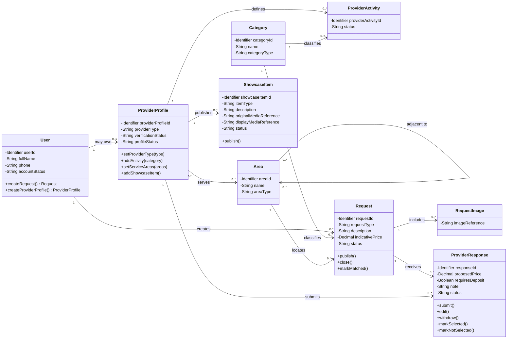

# Class Diagram — Account, Provider, Discovery and Portfolio

> **Status:** `REVIEW DRAFT — NOT BASELINED — DETAILED ANALYSIS REVIEW 2026-09-12`
>
> **Type:** View 1 of one Detailed Analysis Class Model.

## Source basis

- `docs/03-analysis/11-ERD.md` — corrected Conceptual ERD and conceptual identifiers/attributes.
- `docs/03-analysis/05-SRS.md` — current requirements through DEC-076.
- `docs/03-analysis/08-use-cases.md` — UC-01, UC-02, UC-03, UC-04, UC-09 and UC-10.
- `docs/03-analysis/19-provider-activity-model.md` — current Provider Type / Activity rules.
- `docs/03-analysis/20-location-and-neighborhood-model.md` — current Area / adjacency / service-area rules.
- `DEC-008..014`, `DEC-030..033`, `DEC-041`, `DEC-045`, `DEC-064`, `DEC-066`, `DEC-070`, `DEC-074`, `DEC-076`.

> `docs/03-analysis/14-account-portal-model.md` contains legacy wording that allows Service + Product together. That wording is superseded by DEC-074 and is not used as authority for this view until the document is synchronized.

## Diagram

## Detailed analysis interpretation

- `User` واحد يمكنه امتلاك صفر أو `ProviderProfile` واحد؛ Beneficiary/Provider ليست Classes لحسابين منفصلين.
- `ProviderProfile.providerType` في MVP يأخذ نوعًا واحدًا فقط: `SERVICE` أو `PRODUCT`، ولا يمكن الجمع بينهما على الملف نفسه — DEC-074.
- يمكن لـProviderProfile امتلاك عدة `ProviderActivity`، وكل Activity تمثل تصنيفًا داخل نوع المقدم نفسه — DEC-076.
- `0..*` بين ProviderProfile وProviderActivity تسمح بوجود Draft Provider Profile دون تصنيفات مؤقتًا؛ قبل أهلية وظائف التقديم يجب وجود Activity واحدة على الأقل.
- يجب أن يكون `Category.categoryType` متوافقًا مع `ProviderProfile.providerType` لكل ProviderActivity.
- `Area` يمثل District/Neighborhood hierarchy بصورة تحليلية. علاقة `adjacent to` تمثل الجوار المدار داخل YADD، وليس GPS Radius.
- تمثل علاقة `ProviderProfile ↔ Area` مفهوم مناطق الخدمة مباشرة في Class View بدل إبقاء `ProviderServiceArea` كصندوق Class فارغ. إذا احتاجت علاقة منطقة الخدمة Attributes مستقلة في التصميم الفيزيائي، يمكن إعادة تمثيلها Association Class في Chapter Four.
- تمثل علاقة `Area ↔ Area : adjacent to` مفهوم `AreaAdjacency` مباشرة في Class View بدل إبقاء Class فارغة. كيفية فرض symmetry/uniqueness تبقى Design concern في Chapter Four.
- `ShowcaseItem` يمثل Portfolio إذا كان النوع SERVICE وProduct Catalog إذا كان النوع PRODUCT باستخدام مفهوم عرض موحد.
- `Request.indicativePrice` اختياري وغير ملزم على مستوى المتطلبات.
- `RequestImage` عنصر مشتق من المتطلب المعتمد الذي يسمح بإضافة صور اختيارية عند إنشاء Request. لا يثبت هذا الرسم storage provider أو file format أو retention policy.
- لكل Provider استجابة فعالة واحدة فقط لكل Request؛ هذا Business Constraint وليس مجرد multiplicity.
- يجوز تعديل أو سحب Provider Response ما دام Request `Open` وقبل اختيار Provider؛ عند الاختيار تصبح المختارة `Selected` والبقية `NotSelected`.
- `requiresDeposit` Boolean فقط ولا ينشئ Payment/Deposit lifecycle.

## Operation provenance

الـOperations المعروضة **Analysis-level responsibilities** مشتقة من Use Cases والقواعد المعتمدة، وليست API signatures أو method implementations نهائية:

- `User.createRequest()` ← UC-02.
- `User.createProviderProfile()` ← UC-09.
- `ProviderProfile.setProviderType()` / `addActivity()` / `setServiceAreas()` ← UC-09 + DEC-074/076 + Location model.
- `ProviderProfile.addShowcaseItem()` و`ShowcaseItem.publish()` ← UC-10.
- `Request.publish()` / `close()` / `markMatched()` ← UC-02/UC-04 + Request lifecycle.
- `ProviderResponse.submit()` / `edit()` / `withdraw()` / `markSelected()` / `markNotSelected()` ← UC-03/UC-04 + DEC-070.

## Scope boundary

- Visibility markers and operations are used here to satisfy the academic target of a **detailed Class Diagram**; they do not approve programming-language access modifiers or exact implementation signatures.
- Conceptual identifiers are shown because they already exist in the current ERD; detailed PK/FK mapping, indexes, SQL constraints, storage implementation, media storage, and framework-specific methods remain Chapter Four concerns.
- No Composition is asserted here because object-lifetime/deletion ownership is not yet proven by the approved analysis sources.
