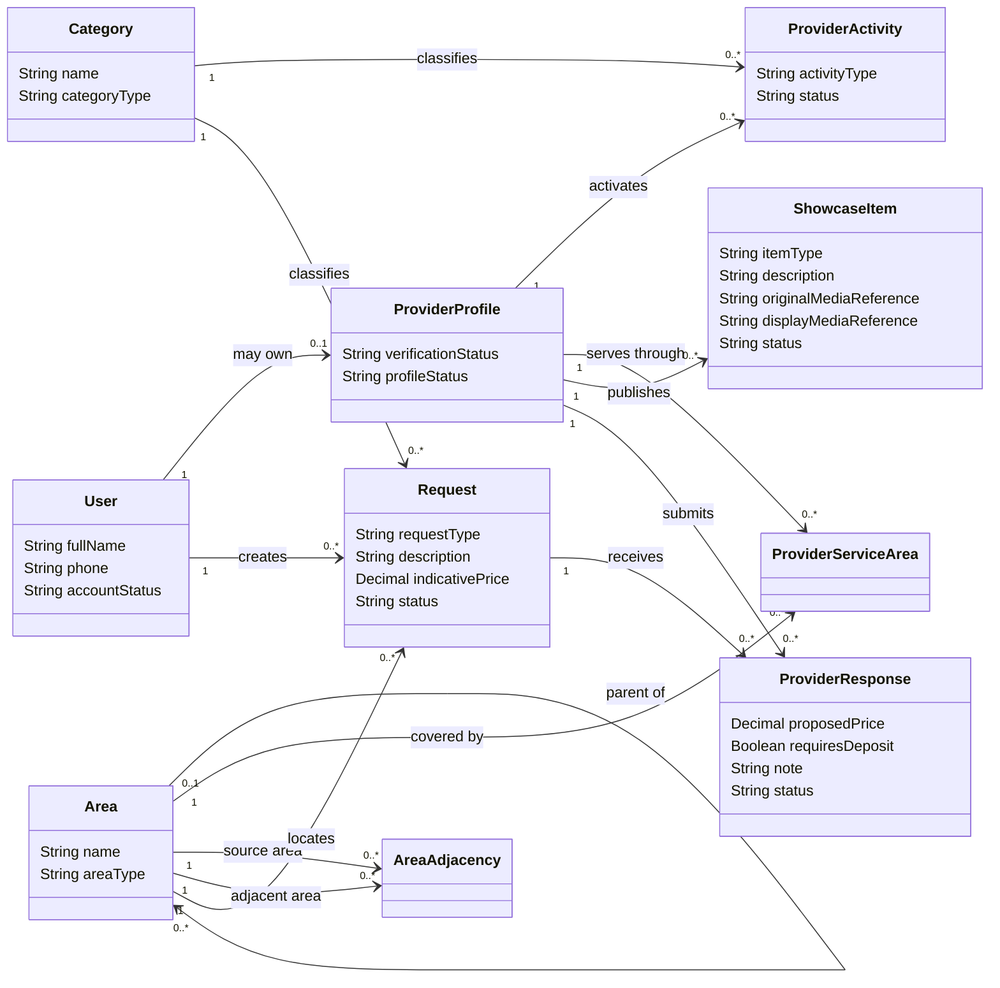

# Class Diagram — Account, Provider, Discovery and Portfolio

> **Status:** `REVIEW DRAFT — NOT BASELINED`
>
> **Type:** View 1 of one Conceptual Domain Model.

## Source basis

- `docs/03-analysis/11-ERD.md` — corrected Conceptual ERD.
- `DEC-008..014`, `DEC-029..033`, `DEC-041`, `DEC-045`, `DEC-064`, `DEC-066`, `DEC-070`.
- Current Account/Portal, Provider Activity and Location models.

## Diagram

## Constraints and interpretation

- `User` واحد يمكنه امتلاك صفر أو `ProviderProfile` واحد؛ Beneficiary/Provider ليست Classes لحسابين منفصلين.
- `ProviderActivity` يسمح بـService Activity أو Product Activity أو كليهما.
- الحد الأدنى الدقيق لعدد Provider Activities عند وجود Provider Profile ما يزال بحاجة Reconciliation: الـCore ERD يسمح `0..*` بينما Provider Activity model يرسم `1..*`.
- `Area` يمثل District/Neighborhood hierarchy بصورة مفاهيمية.
- `AreaAdjacency` يمثل قائمة جوار مُدارة وفق DEC-033، وليس GPS Radius. اتجاه/تناظر العلاقة وكيفية منع duplicates قرار Physical Design لاحق.
- `ProviderServiceArea` يمثل تغطية Provider للمناطق.
- `ShowcaseItem` يوحد Portfolio/Catalog مفاهيميًا.
- `Request.indicativePrice` اختياري وغير ملزم على مستوى المتطلبات.
- لكل Provider استجابة فعالة واحدة فقط لكل Request؛ هذا Business Constraint وليس مجرد multiplicity.
- `requiresDeposit` Boolean فقط ولا ينشئ Payment/Deposit lifecycle.

## Scope note

الـAttributes المعروضة مختارة لإظهار البنية المفاهيمية وليست قائمة exhaustive لكل الحقول أو الوسائط. Media storage والـPK/FK والـindexes والتفاصيل الفيزيائية تؤجل إلى Chapter Four.
