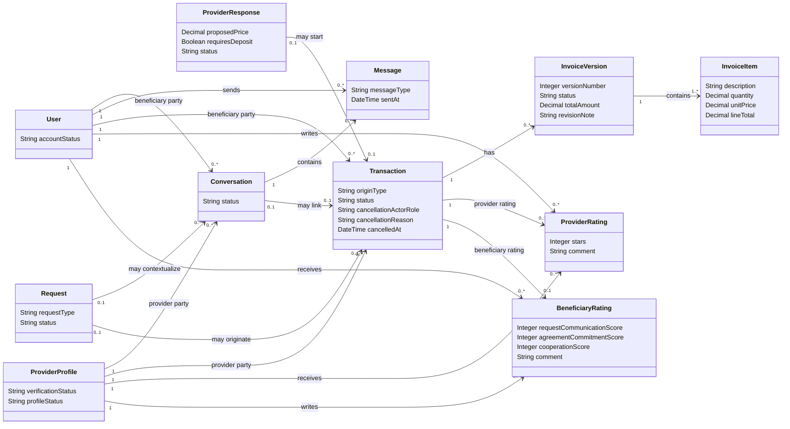

# Class Diagram — Communication, Transaction, Invoice and Ratings

> **Status:** `REVIEW DRAFT — NOT BASELINED`
>
> **Type:** View 2 of one Conceptual Domain Model.

## Source basis

- `docs/03-analysis/11-ERD.md` — corrected Conceptual ERD.
- `DEC-015/016/023..025/046..056/063/066/068..073`.
- Current Business Rules, Lifecycles, Use Cases and In-App Communication model.

## Diagram

## Constraints and interpretation

- `Conversation` قد توجد قبل Transaction؛ Chat وحدها لا تنشئ Transaction.
- Request Route يبدأ Transaction عند اختيار Provider، بينما Direct Search يحتاج Request Transaction Start ثم confirmation من الطرف الآخر.
- Request واحدة تنتج صفر أو Transaction واحدة فقط.
- `Conversation ↔ Transaction` موضحة حاليًا كـ`0..1 ↔ 0..1` لمزامنة الـERD الحالي، لكن إعادة استخدام Conversation نفسها لمعاملة ثانية مستقبلًا لم تُحسم في القرارات، لذلك تبقى هذه multiplicity بحاجة Verification قبل Relation Schema النهائي.
- عند الإلغاء يحتفظ النموذج مفاهيميًا بـActor Role + Reason + Time وفق DEC-048/BR-019.
- `Completed` النهاية الناجحة؛ `Cancelled` و`Disputed` نهايات بديلة، ولا توجد حالة `Closed`.
- `InvoiceVersion` يحفظ تاريخ التعديلات؛ الشكل الفيزيائي قد يصبح `Invoice + InvoiceRevision` لاحقًا مع الحفاظ على التاريخ.
- Provider Rating حدها الأقصى واحدة لكل Transaction وتكون مطلوبة من Beneficiary بعد Completed.
- Beneficiary Rating حدها الأقصى واحدة لكل Transaction واختيارية من Provider بعد Completed.
- Ratings لا تغيّر Transaction status.
- لا توجد Payment/Refund/Escrow/Settlement entities داخل هذه البنية.

## UML note

العلاقات plain associations عمدًا. لم يثبت التحليل الحالي object-lifetime/deletion semantics اللازمة لاستخدام UML composition بثقة.

## Scope note

Attributes هنا غير exhaustive. محتوى الرسالة/المرفقات ووسائط الفاتورة وغيرها متطلبات وظيفية يمكن أن تمثل لاحقًا عبر Media design دون تحويل هذا الرسم المفاهيمي إلى Relation Schema مبكر.
