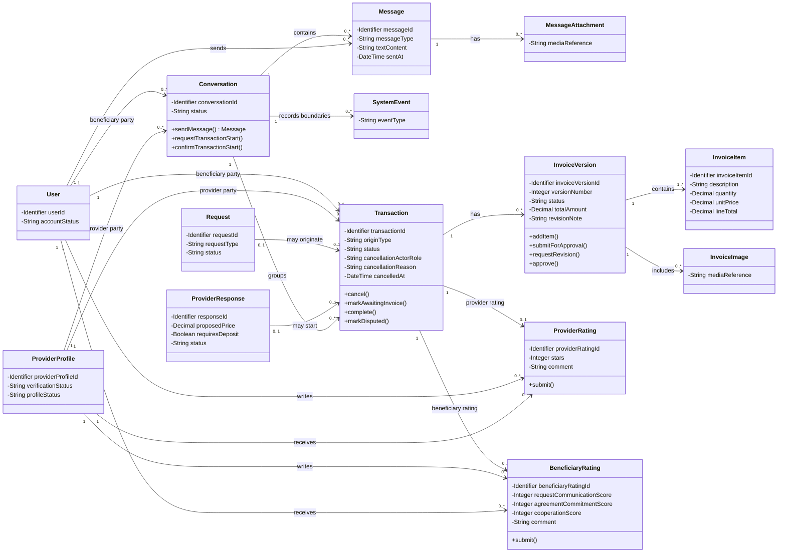

# Class Diagram — Communication, Transaction, Invoice and Ratings

> **Status:** `SEMANTICALLY VERIFIED — TEAM APPROVED — NOT BASELINED — VISUAL/A4 FINALIZATION PENDING`
>
> **Type:** View 2 of one Detailed Analysis Class Model.

## Source basis

- `docs/03-analysis/11-ERD.md` — corrected Conceptual ERD and conceptual identifiers/attributes.
- `docs/03-analysis/07-lifecycles.md` — Request/Response/Transaction/Invoice/Rating states.
- `docs/03-analysis/08-use-cases.md` — UC-01, UC-03, UC-04, UC-05, UC-06, UC-07 and UC-07B.
- `docs/03-analysis/15-invoice-approval-and-dispute.md` — invoice revision/history/approval/dispute rules.
- `docs/03-analysis/18-rating-reputation-model.md` — current rating rules.
- `DEC-015/016/023..025/046..056/063/066/068..075`.

## Diagram

## Detailed analysis interpretation

- `Conversation` قد توجد قبل Transaction؛ Chat وحدها لا تنشئ Transaction.
- بين نفس Beneficiary ونفس Provider تبقى Conversation واحدة مستمرة، ويمكن أن تضم صفرًا أو عدة Transactions عبر الزمن — DEC-075.
- القيد المفاهيمي الحاكم هو: **`{unique Conversation per Beneficiary–Provider pair}`**. الـmultiplicities العامة تسمح لكل User ولكل ProviderProfile بعدة Conversations مع أطراف مختلفة، بينما هذا القيد يمنع إنشاء محادثتين مستقلتين لنفس الزوج.
- `SystemEvent` عنصر تحليل مشتق من DEC-075 لتمثيل الفواصل/الأحداث الواضحة عند بدء وانتهاء Transactions داخل Conversation المستمرة. الربط الفيزيائي الدقيق بين System Event أو Message وTransaction محددة لم يُحسم، لذلك لا يفرض هذا الرسم Association مباشرة من `SystemEvent` إلى `Transaction`.
- `Message.textContent` يمثل الرسائل النصية المعتمدة، و`MessageAttachment` يمثل الصور/المرفقات المدعومة في التواصل. لا يثبت هذا الرسم storage provider أو file format أو retention policy.
- قد تبدأ أو تستمر Conversation في سياق Request، لكن هذا الـView لا يفرض علاقة مباشرة `Request ↔ Conversation` لأن Conversation المستمرة قد تمر بعدة Request contexts عبر الزمن؛ طريقة تمثيل تلك السياقات تؤجل إلى Chapter Four.
- Request Route يبدأ Transaction عند اختيار Provider، بينما Direct Search يحتاج Request Transaction Start ثم confirmation من الطرف الآخر.
- Request واحدة تنتج صفر أو Transaction واحدة فقط.
- عند الإلغاء يحتفظ Transaction بالطرف الذي ألغى والسبب والتوقيت وفق DEC-048/BR-019.
- `Completed` النهاية الناجحة؛ `Cancelled` و`Disputed` نهايات بديلة، ولا توجد حالة `Closed`.
- `InvoiceVersion` يحفظ تاريخ التعديلات ولا يستبدل النسخ السابقة بلا أثر. الشكل الفيزيائي النهائي قد يصبح `Invoice + InvoiceRevision` أو تمثيلًا مكافئًا في Chapter Four بشرط الحفاظ على التاريخ.
- `InvoiceImage` عنصر مشتق من UC-06 الذي يسمح بصور اختيارية داخل الفاتورة. لا يثبت هذا الرسم format أو storage أو retention.
- Invoice approval يجعل Transaction = `Completed`. عدم الرد لا يساوي approval ولا يوجد Auto-Approval.
- Provider Rating حدها الأقصى واحدة لكل Transaction وتكون مطلوبة من Beneficiary بعد Completed: 1–5 stars + optional comment.
- Beneficiary Rating حدها الأقصى واحدة لكل Transaction واختيارية من Provider بعد Completed: ثلاثة مؤشرات 1–5 + optional comment.
- Ratings لا تغيّر Transaction status، ولا تفتح لمعاملة `Cancelled` أو `Disputed`.
- لا توجد Payment/Refund/Escrow/Settlement entities داخل هذه البنية.

## Operation provenance

الـOperations المعروضة **Analysis-level responsibilities** مشتقة من Use Cases/Lifecycles والقواعد المعتمدة، وليست API signatures أو method implementations نهائية:

- `Conversation.sendMessage()` ← approved in-app text communication.
- `Conversation.requestTransactionStart()` / `confirmTransactionStart()` ← Direct Search transaction-start flow.
- `Transaction.cancel()` ← UC-05 + Transaction lifecycle.
- `Transaction.markAwaitingInvoice()` / `complete()` / `markDisputed()` ← Transaction/Invoice lifecycle.
- `InvoiceVersion.addItem()` / `submitForApproval()` / `requestRevision()` / `approve()` ← UC-06 + Invoice Approval model.
- `ProviderRating.submit()` ← UC-07.
- `BeneficiaryRating.submit()` ← UC-07B.

## UML / Design boundary

- Visibility markers and operations are used here to satisfy the academic target of a **detailed Class Diagram**; they do not approve programming-language access modifiers or exact implementation signatures.
- Classes repeated from another View, such as `User`, `ProviderProfile`, `Request`, and `ProviderResponse`, are the same conceptual classes. This View shows only the attributes needed to understand the communication/transaction context.
- Plain associations are used intentionally. No Composition is asserted because object-lifetime/deletion ownership has not been proven by the approved analysis sources.
- Detailed PK/FK mapping, indexes, SQL constraints, exact media schema, physical enforcement of Conversation pair uniqueness, physical Message/SystemEvent↔Transaction mapping, and storage/retention policies remain Chapter Four design concerns.
