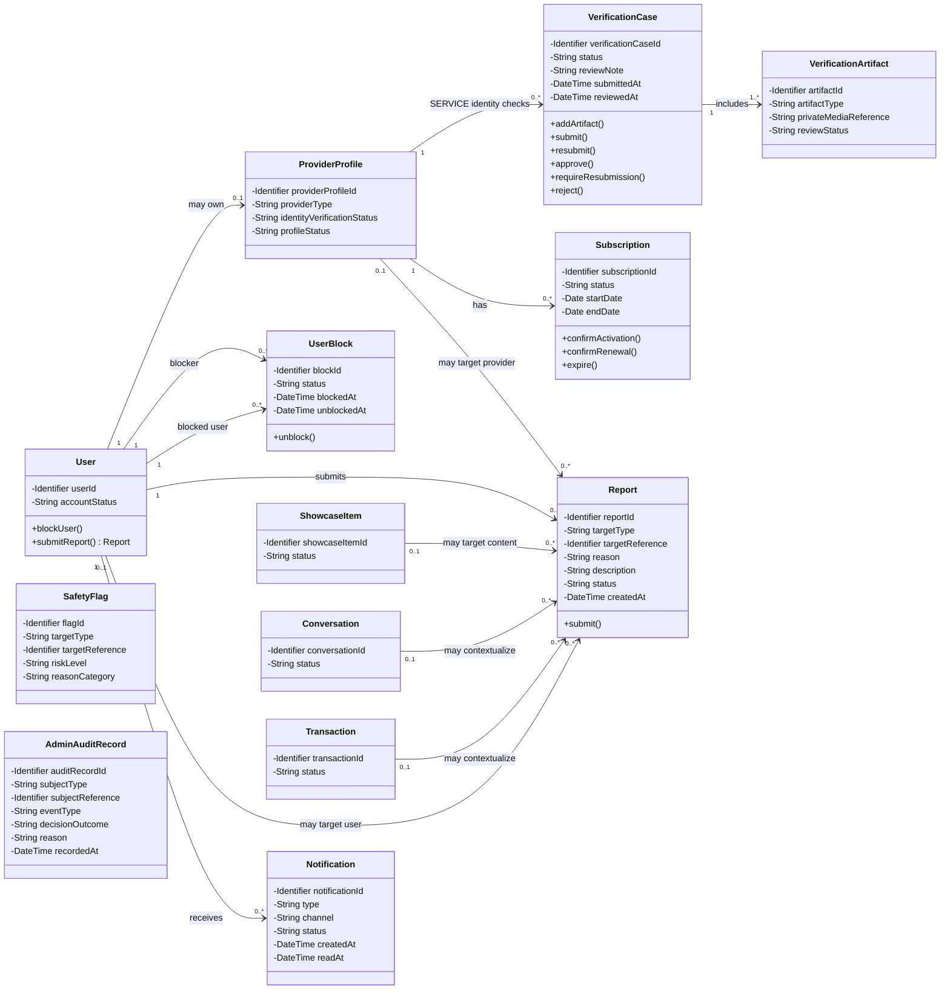

# Class Diagram — Verification, Subscription and Trust / Administration

> **Status:** `SEMANTICALLY VERIFIED — TEAM APPROVED — SYNCHRONIZED THROUGH DEC-090 — NOT BASELINED — VISUAL/A4 FINALIZATION PENDING`
>
> **Type:** View 3 of one Detailed Analysis Class Model.

## Source basis

- `docs/03-analysis/11-ERD.md` — corrected Conceptual ERD and supporting-model identifiers/attributes.
- `docs/03-analysis/21-provider-verification-model.md` — verification lifecycle, human-review rules and sensitive-data boundaries.
- `docs/03-analysis/22-ai-trust-safety-model.md` — moderation, flags, human review and audit requirements.
- `docs/03-analysis/23-provider-subscription-model.md` — subscription lifecycle and manual activation/renewal rules.
- `DEC-035..043`, `DEC-053/054`, `DEC-073`, `DEC-085/086/088/089/090`.

## Diagram

## Detailed analysis interpretation

- Identity Verification evidence تخص Service Provider فقط في MVP، وهي حساسة وغير عامة؛ القرار النهائي `Verified` / `ResubmissionRequired` / `Rejected` بشري ومن موظف YADD مخول. Product Provider لا يحتاج Government ID ولا يحصل على Identity Verified badge دون هذا المسار.
- `VerificationCase.reviewNote` يمثل الملاحظة/السبب المطلوب عند `ResubmissionRequired` أو `Rejected`; لا يثبت format أو length أو retention policy.
- `VerificationCase` و`VerificationArtifact` يعكسان Service Provider verification: National ID أو Passport + صورة الوثيقة + صورة شخصية مع الوثيقة. مدة الاحتفاظ تبقى Needs Legal Verification.
- `Identity Verified` شرط إضافي للـSERVICE فقط؛ الاشتراك النشط وحالة الملف/التصنيف شروط مستقلة لكلا النوعين.
- `Subscription` مطلوبة لكلا نوعي Provider ومدتها 30 يومًا. التفعيل/التجديد يدوي بعد تحقق الدفع الخارجي؛ Reminder قبل 3 أيام و24h. Expired لا يوقف المعاملات الجارية لكنه يمنع تعاملات جديدة.
- `UserBlock` مستقل عن Report ويدعم Unblock. Block يمنع التفاعل الجديد لكنه لا يكسر Active Transaction ولا يمنع إجراءاتها/إشعاراتها.
- `Report` يمكن أن يرتبط بمستخدم، Provider context، Showcase Item، Conversation أو Transaction context. يبقى `targetReference` تمثيلًا polymorphic مفاهيميًا إلى أن يحسم Chapter Four mapping.
- `SafetyFlag` مفهوم تحليلي لنتيجة Rules/AI checks أو Behavioral signals، ولا يعني أن المخالفة مؤكدة أو أن العقوبة النهائية آلية.
- `SafetyFlag.reasonCategory` مشتق من متطلب الحوكمة الذي يلزم أن يستطيع الموظف معرفة سبب/فئة الاشتباه التي ولدت الـFlag؛ لا يثبت هذا الرسم قائمة قيم نهائية أو threshold أو provider تقني.
- `AdminAuditRecord` يمثل سجل التدقيق للقرارات الحساسة، بما في ذلك outcome بشري من القائمة المعتمدة في DEC-089 مع السبب والموظف/الزمن. الربط الفيزيائي يبقى Design concern.
- `ShowcaseItem`, `Conversation`, و`Transaction` Cross-view references إلى نفس الـClasses الموجودة في Views الأخرى؛ أضيفت identifiers/status فقط حتى لا تظهر كصناديق فارغة.
- Transaction Complaint يمكن أن تستخدم `Report`/complaint context، لكنها لا تنشئ Payment/Refund/Compensation entity ولا تمنح الإدارة سلطة تحكيم مالي.
- لا تُنشأ Classes مثل `OCRService`, `FaceRecognitionService`, `LivenessService` أو AI provider معين في هذا Domain Class Diagram لأن اختيار المزود والبنية التقنية التفصيلية ما يزال مفتوحًا.

## Operation provenance

الـOperations المعروضة **Analysis-level responsibilities** مشتقة من النماذج والقواعد المعتمدة، وليست API signatures أو implementation methods نهائية:

- `User.blockUser()` / `submitReport()` ← Block + Report rules.
- `VerificationCase.addArtifact()` / `submit()` / `resubmit()` ← Provider Verification lifecycle.
- `VerificationCase.approve()` / `requireResubmission()` / `reject()` ← authorized human-review outcomes.
- `Subscription.confirmActivation()` / `confirmRenewal()` / `expire()` ← 30-day Provider Subscription lifecycle.
- `Report.submit()` ← Report flow to administrative review.
- `UserBlock.unblock()` ← DEC-088.
- `Notification` ← DEC-090 channel policy.

## UML / Design boundary

- Visibility markers and operations are used here to satisfy the academic target of a **detailed Class Diagram**; they do not approve programming-language access modifiers or exact implementation signatures.
- Plain associations are used intentionally. No Composition is asserted because object-lifetime/deletion ownership has not been proven by the approved analysis sources.
- `SafetyFlag` and `AdminAuditRecord` are intentionally not connected by speculative target associations because target mapping, retention and storage details remain open.
- Detailed authorization schema, verification/AI retention periods, AI provider/thresholds, moderation appeal mechanics, subscription plans/prices/payment-proof procedure, polymorphic Report/Flag/Audit mapping, and unblock/history modeling remain Chapter Four / Needs Verification concerns.
