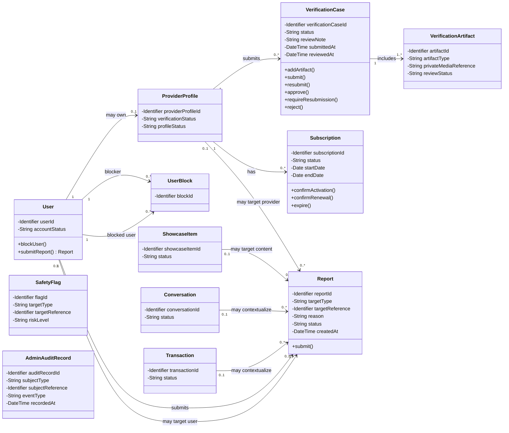

# Class Diagram — Verification, Subscription and Trust / Administration

> **Status:** `REVIEW DRAFT — NOT BASELINED — DETAILED ANALYSIS REVIEW 2026-09-12`
>
> **Type:** View 3 of one Detailed Analysis Class Model.

## Source basis

- `docs/03-analysis/11-ERD.md` — corrected Conceptual ERD and supporting-model identifiers/attributes.
- `docs/03-analysis/21-provider-verification-model.md` — verification lifecycle, human-review rules and sensitive-data boundaries.
- `docs/03-analysis/22-ai-trust-safety-model.md` — moderation, flags, human review and audit requirements.
- `docs/03-analysis/23-provider-subscription-model.md` — subscription lifecycle and manual activation/renewal rules.
- `DEC-034..043`, `DEC-053/054`, `DEC-073`.

## Diagram

## Detailed analysis interpretation

- Verification evidence حساسة وغير عامة، والقرار النهائي `Verified` / `ResubmissionRequired` / `Rejected` بشري ومن موظف YADD مخول.
- `VerificationCase.reviewNote` يمثل الملاحظة/السبب المطلوب عند `ResubmissionRequired` أو `Rejected`; لا يثبت format أو length أو retention policy.
- `VerificationCase` و`VerificationArtifact` يعكسان الحد الأدنى المعتمد للتحقق. الأنواع الدقيقة لوثائق الهوية والجوانب المطلوبة وفترات الاحتفاظ تبقى Needs Verification.
- `Verified` يحقق شرط التحقق فقط؛ لا يعني وحده أن Provider Profile أصبح مؤهلًا لكل وظائف التقديم. الاشتراك النشط، حالة الملف، والنشاط/التصنيف الصحيح تبقى شروطًا مستقلة حسب الوظيفة.
- `Subscription` منفصلة عن Provider Verification وعن معاملات Beneficiary↔Provider. التفعيل/التجديد يدوي بواسطة موظف مخول بعد تحقق تشغيلي من الدفع الخارجي، ولا يوجد Payment Gateway داخل YADD لهذا المسار في MVP.
- `UserBlock` يمثل Block كعلاقة حماية مباشرة مستقلة عن `Report`. الحظر يوقف التواصل المباشر ولا يثبت مخالفة ولا ينشئ عقوبة إدارية تلقائية.
- لا يضيف هذا الـView حقولًا مثل `blockedAt`, `unblockedAt`, `status` أو عملية `unblock()` إلى `UserBlock` لأن lifecycle/history الخاصة بفك الحظر لم تُحسم بعد.
- `Report` يمكن أن يرتبط بمستخدم، Provider context، Showcase Item، Conversation أو Transaction context. يبقى `targetReference` تمثيلًا polymorphic مفاهيميًا إلى أن يحسم Chapter Four mapping.
- `SafetyFlag` مفهوم تحليلي لنتيجة Rules/AI checks أو Behavioral signals، ولا يعني أن المخالفة مؤكدة أو أن العقوبة النهائية آلية.
- `AdminAuditRecord` يمثل سجل التدقيق المطلوب للقرارات/المراجعات الحساسة. طريقة الربط الفيزيائي بالـVerification/Report/Flag/Access events تبقى Design concern.
- `ShowcaseItem`, `Conversation`, و`Transaction` Cross-view references إلى نفس الـClasses الموجودة في Views الأخرى؛ أضيفت identifiers/status فقط حتى لا تظهر كصناديق فارغة.
- Transaction Complaint يمكن أن تستخدم `Report`/complaint context، لكنها لا تنشئ Payment/Refund/Compensation entity ولا تمنح الإدارة سلطة تحكيم مالي.
- لا تُنشأ Classes مثل `OCRService`, `FaceRecognitionService`, `LivenessService` أو AI provider معين في هذا Domain Class Diagram لأن اختيار المزود والبنية التقنية التفصيلية ما يزال مفتوحًا.

## Operation provenance

الـOperations المعروضة **Analysis-level responsibilities** مشتقة من النماذج والقواعد المعتمدة، وليست API signatures أو implementation methods نهائية:

- `User.blockUser()` / `submitReport()` ← Block + Report rules.
- `VerificationCase.addArtifact()` / `submit()` / `resubmit()` ← Provider Verification lifecycle.
- `VerificationCase.approve()` / `requireResubmission()` / `reject()` ← authorized human-review outcomes.
- `Subscription.confirmActivation()` / `confirmRenewal()` / `expire()` ← Provider Subscription lifecycle.
- `Report.submit()` ← Report flow to administrative review.

## UML / Design boundary

- Visibility markers and operations are used here to satisfy the academic target of a **detailed Class Diagram**; they do not approve programming-language access modifiers or exact implementation signatures.
- Plain associations are used intentionally. No Composition is asserted because object-lifetime/deletion ownership has not been proven by the approved analysis sources.
- `SafetyFlag` and `AdminAuditRecord` are intentionally not connected by speculative target associations because target mapping, retention and storage details remain open.
- Detailed authorization schema, accepted identity-document types, verification/AI retention periods, AI provider/thresholds, moderation appeal mechanics, subscription plans/prices/payment-proof procedure, polymorphic Report/Flag/Audit mapping, and unblock/history modeling remain Chapter Four / Needs Verification concerns.
