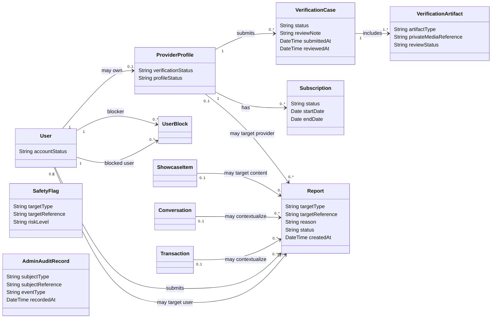

# Class Diagram — Verification, Subscription and Trust / Administration

> **Status:** `REVIEW DRAFT — NOT BASELINED`
>
> **Type:** View 3 of one Conceptual Domain Model.

## Source basis

- `docs/03-analysis/11-ERD.md` — corrected Conceptual ERD.
- `DEC-034..043`, `DEC-053/054`, `DEC-073`.
- Current Provider Verification, Provider Subscription and AI Trust & Safety models.

## Diagram

## Constraints and interpretation

- Verification evidence حساسة وغير عامة، والقرار النهائي Verified/ResubmissionRequired/Rejected بشري.
- `VerificationCase.reviewNote` يمثل الملاحظة/السبب المطلوب عند Resubmission Required أو Rejected؛ لا يثبت format أو length أو retention policy.
- Provider Verification وSubscription شرطان منفصلان؛ Verified لا يعني Active Subscription.
- `UserBlock` يمثل Block كعلاقة مستقلة عن Report. الحظر يوقف التواصل المباشر ولا يثبت مخالفة ولا ينشئ عقوبة إدارية تلقائية.
- `Report` سجل مراجعة يمكن أن يرتبط بمستخدم/سياق Provider/Conversation/Behavior/Showcase Item، ويبقى `targetReference` polymorphic concept إلى أن يحسم Chapter Four mapping.
- `SafetyFlag` و`AdminAuditRecord` مفاهيم داعمة معتمدة من Trust & Safety/D8، لكنها لا تُرسم بعلاقات تفصيلية هنا لأن linking/storage/retention والـthresholds لم تعتمد بعد. وجودهما لا يعني وجود قرار آلي نهائي.
- Transaction Complaint يمكن أن تستخدم Report/complaint context، لكن لا تنشئ Payment/Refund/Compensation entity ولا تمنح الإدارة سلطة تحكيم مالي.
- لا تستخدم composition هنا لأن lifecycle/deletion ownership لم يعتمد.

## Needs Verification / Design boundary

- exact identity-document types and retention;
- AI provider, thresholds, flag persistence and appeal mechanics;
- administrative authorization schema;
- subscription plans/prices/payment-proof procedure;
- physical mapping of polymorphic Report/Flag/Audit targets;
- whether unblock/history requires separate lifecycle records.
