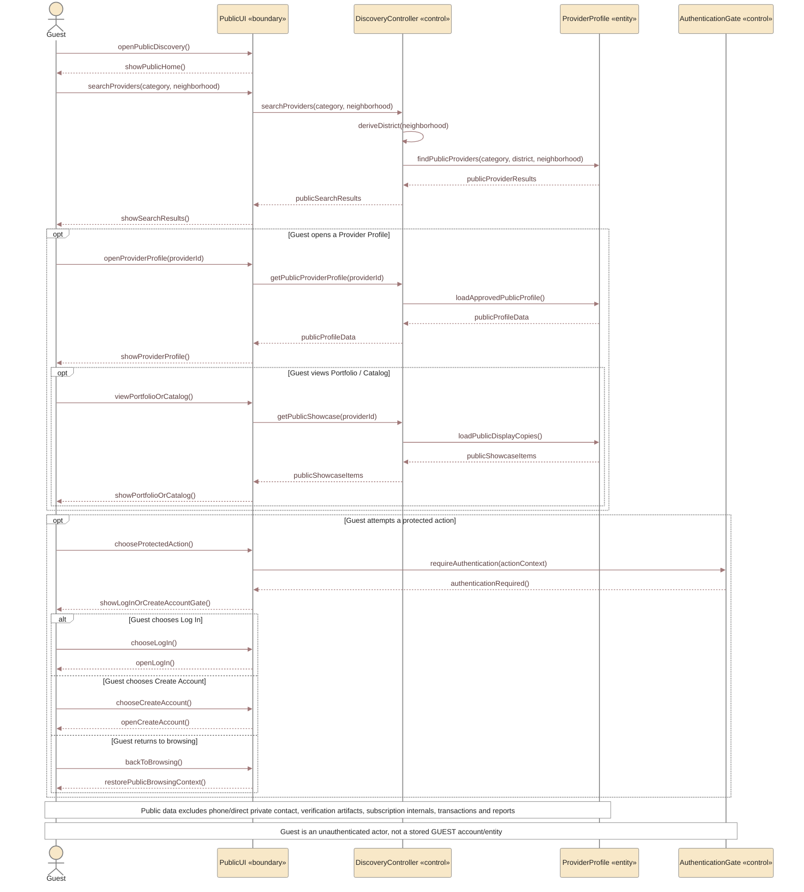

# Sequence 17 — Guest Public Browsing & Protected Action Gate

> **Status:** `REVIEW DRAFT — SYNCHRONIZED 2026-09-19 — NOT BASELINED`
>
> **Purpose:** Represents the approved `Guest` public-browsing boundary and the Authentication gate for protected actions. This is a documentation/interaction decomposition of approved Guest behavior; it does not create a new account type or domain entity.

## Source basis

- `DEC-077` — Guest public browse/search/view + protected-action Authentication gate.
- `DEC-031` and current approved Location UI convention — Neighborhood is user-facing; District is derived internally.
- `FR-GST-01..06`, `FR-003`.
- `UC-00 — Browse Public Provider Information`.
- `PUB-01..06` approved UI contracts.

## Diagram

## Scope boundary

- Public browse/search/profile/showcase viewing only.
- Protected actions such as Request creation, private Chat, Transaction, Rating, Block and Report require Authentication.
- The UI redirect is not the security boundary; Backend/API authorization must still enforce protected operations.
- Exact return-to-intended-action behavior after Authentication remains an interaction-detail policy and is not invented here.
