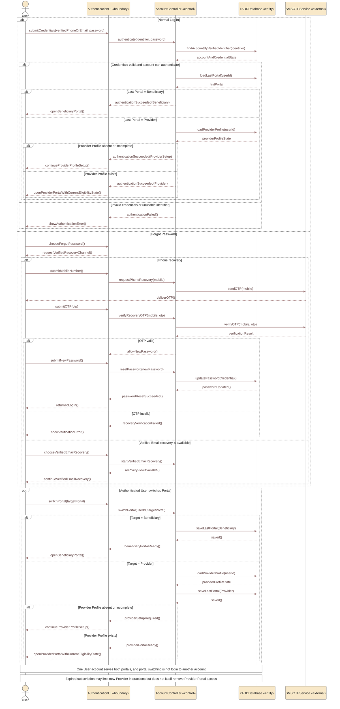

# Sequence 18 — Authentication & Portal Access

> **Status:** `REVIEW DRAFT — SYNCHRONIZED 2026-09-19 — NOT BASELINED`
>
> **Purpose:** Represents approved returning-user Authentication, password recovery, last-portal restoration and portal switching without creating separate Beneficiary/Provider accounts.

## Source basis

- `DEC-008..011`, `DEC-078`, `DEC-079`, `DEC-080`, `DEC-085`, `DEC-086`.
- `FR-001C..001F`.
- Account / Portal Model.
- `AUTH-01`, `AUTH-04`, `AUTH-05` approved UI contracts.

## Diagram

## Scope boundary

- Login uses verified Mobile or verified Email + Password; there is no independent Username.
- Phone OTP is the primary Forgot Password recovery path; verified Email may be an additional recovery channel.
- OTP lifetime, resend cooldown, attempt caps and lockout thresholds remain unfrozen and are not modeled.
- Provider Portal access is distinct from eligibility to start new provider interactions.
