# Sequence 19 — Manage Account, Deactivation & Reactivation

> **Status:** `REVIEW DRAFT — SYNCHRONIZED 2026-09-19 — NOT BASELINED`
>
> **Purpose:** Represents approved User-account management, verification-sensitive changes, Deactivate Account and Reactivation. It does not manage Provider Profile fields such as Product Trade Name.

## Source basis

- `DEC-079`.
- `FR-001G`, `FR-001H`.
- `BR-050`.
- Account / Portal Model.
- `AUTH-06 — Manage / Deactivate Account`.

## Diagram

```mermaid
%%{init: {"theme":"base","themeVariables":{"background":"#FFFFFF","fontFamily":"Arial","actorBkg":"#F8E8C8","actorBorder":"#7E7E7E","actorTextColor":"#222222","actorLineColor":"#8A8A8A","signalColor":"#A07878","signalTextColor":"#5C3F3F","labelBoxBkgColor":"#FFFFFF","labelBoxBorderColor":"#7E7E7E","labelTextColor":"#222222","loopTextColor":"#222222","noteBkgColor":"#FFFFFF","noteBorderColor":"#7E7E7E","noteTextColor":"#222222","activationBkgColor":"#C8E0E8","activationBorderColor":"#7B969C","sequenceNumberColor":"#222222"}}}%%
sequenceDiagram
    actor U as User
    participant UI as AccountUI «boundary»
    participant AC as AccountController «control»
    participant DB as YADDDatabase «entity»
    participant OTP as SMSOTPService «external»

    U->>UI: openAccountSettings()
    UI->>AC: getAccountData(userId)
    AC->>DB: loadAccount(userId)
    DB-->>AC: accountData
    AC-->>UI: accountData
    UI-->>U: showAccountSettings()

    alt Update names or profile photo
        U->>UI: saveAccountChanges(changes)
        UI->>AC: updateAccount(changes)
        AC->>DB: loadProviderVerificationContext(userId)
        DB-->>AC: verificationContext

        alt Verified Service Provider changes legal name
            AC->>DB: saveAccountChanges(changes)
            DB-->>AC: changesSaved()
            AC->>DB: markIdentityVerificationForHumanReReview()
            DB-->>AC: reReviewRequired()
            AC-->>UI: changesSavedWithVerificationReReview()
            UI-->>U: showReReviewNotice()
        else No identity re-review trigger
            AC->>DB: saveAccountChanges(changes)
            DB-->>AC: changesSaved()
            AC-->>UI: changesSaved()
            UI-->>U: showSaveConfirmation()
        end

    else Change Mobile Number
        U->>UI: submitNewMobile(newMobile)
        UI->>AC: requestMobileChange(newMobile)
        AC->>OTP: sendOTP(newMobile)
        OTP-->>U: deliverOTP()
        U->>UI: submitOTP(otp)
        UI->>AC: verifyNewMobileOTP(newMobile, otp)
        AC->>OTP: verifyOTP(newMobile, otp)
        OTP-->>AC: verificationResult

        alt OTP valid
            AC->>DB: replaceVerifiedMobile(newMobile)
            DB-->>AC: mobileUpdated()
            AC-->>UI: mobileChangeSucceeded()
            UI-->>U: showMobileChangeConfirmation()
        else OTP invalid
            AC-->>UI: mobileVerificationFailed()
            UI-->>U: showVerificationError()
        end

    else Change Email
        U->>UI: submitNewEmail(newEmail)
        UI->>AC: updateEmail(newEmail)
        AC->>DB: saveEmailAsUnverified(newEmail)
        DB-->>AC: emailUpdatedUnverified()
        AC-->>UI: emailSavedVerificationRequired()
        UI-->>U: showEmailVerificationRequired()

    else Change Password
        U->>UI: submitPasswordChange(currentPassword, newPassword)
        UI->>AC: changePassword(currentPassword, newPassword)
        AC->>DB: verifyCurrentPassword()
        DB-->>AC: verificationResult

        alt Current password valid
            AC->>DB: updatePasswordCredential(newPassword)
            DB-->>AC: passwordUpdated()
            AC-->>UI: passwordChangeSucceeded()
            UI-->>U: showPasswordChangeConfirmation()
        else Current password invalid
            AC-->>UI: passwordChangeRejected()
            UI-->>U: showPasswordError()
        end

    else Deactivate Account
        U->>UI: confirmDeactivateAccount()
        UI->>AC: deactivateAccount(userId)
        AC->>DB: setAccountDeactivated()
        DB-->>AC: accountDeactivated()
        AC-->>UI: deactivationSucceeded()
        UI-->>U: showDeactivatedState()

    else Reactivate Account
        U->>UI: requestReactivation(mobile)
        UI->>AC: checkReactivationAllowed(mobile)
        AC->>DB: loadAccountAdministrativeState(mobile)
        DB-->>AC: accountAdministrativeState

        alt Account not administratively suspended
            AC->>OTP: sendOTP(mobile)
            OTP-->>U: deliverOTP()
            U->>UI: submitOTP(otp)
            UI->>AC: verifyReactivationOTP(mobile, otp)
            AC->>OTP: verifyOTP(mobile, otp)
            OTP-->>AC: verificationResult

            alt OTP valid
                AC->>DB: reactivateAccount()
                DB-->>AC: accountReactivated()
                AC-->>UI: reactivationSucceeded()
                UI-->>U: showReactivatedState()
            else OTP invalid
                AC-->>UI: reactivationVerificationFailed()
                UI-->>U: showVerificationError()
            end
        else Account administratively suspended
            AC-->>UI: reactivationBlockedByAdministrativeState()
            UI-->>U: showReactivationUnavailable()
        end
    end

    Note over U,DB: MVP supports Deactivate/Reactivate, not self-service Hard Delete
    Note over U,DB: Historical Transactions, Invoices, Ratings and Reports remain retained according to the current model
```

## Scope boundary

- Product `Trade Name` belongs to Provider Profile, not User Account.
- Email change does not make the new Email valid for login/recovery until verification succeeds; the exact email-verification mechanism is not frozen here.
- Reactivation requires phone verification unless the account is administratively suspended.
- Sensitive-data retention periods remain governed by their separate open/legal questions.
