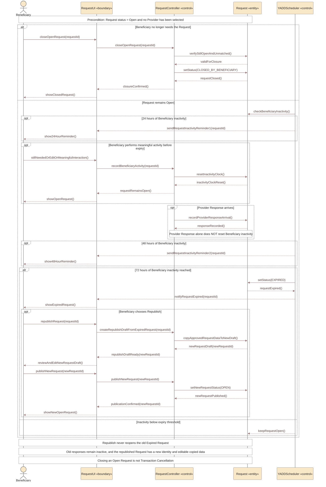

# Sequence 20 — Open Request Closure, Inactivity, Expiry & Republish

> **Status:** `REVIEW DRAFT — SYNCHRONIZED 2026-09-19 — NOT BASELINED`
>
> **Purpose:** Represents the approved lifecycle of an already-published Open Request after creation: Beneficiary closure, inactivity reminders/expiry, activity reset and Republish as a new Request.

## Source basis

- `DEC-048`, `DEC-081`.
- `FR-005C..005F`.
- `BR-018`, `BR-020`, `BR-052`, `BR-053`.
- Request Lifecycle and Request Cancellation/Expiry Model.
- `BEN-02`, `BEN-04` approved UI contracts.

## Diagram

## Scope boundary

- This sequence begins after Request creation/publication.
- Provider selection and Transaction creation are handled by the separate Provider-selection sequence.
- Exact scheduler implementation is a derived modeling role; the approved behavior is the timing policy, not a mandated background-service architecture.
