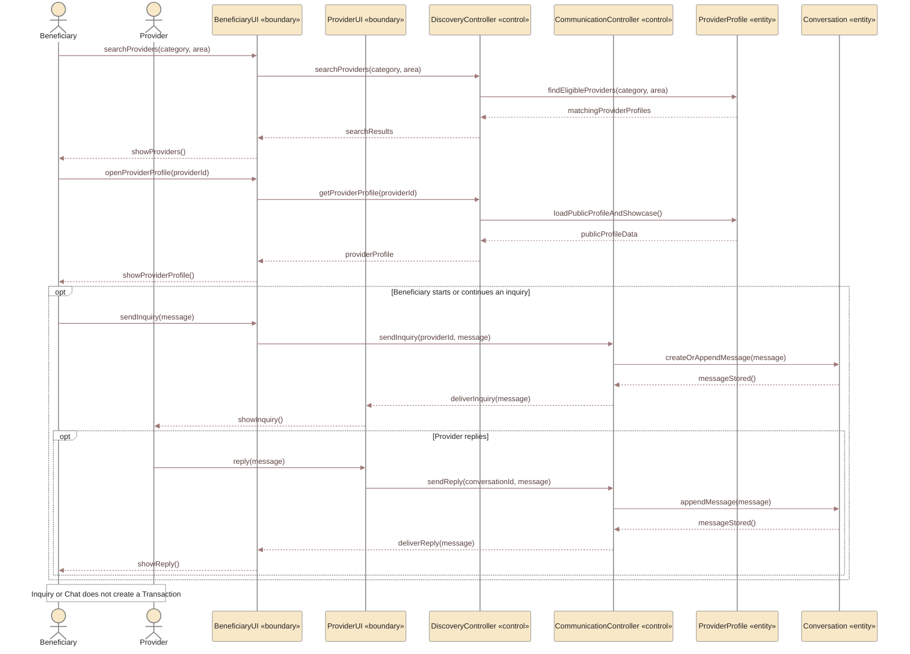
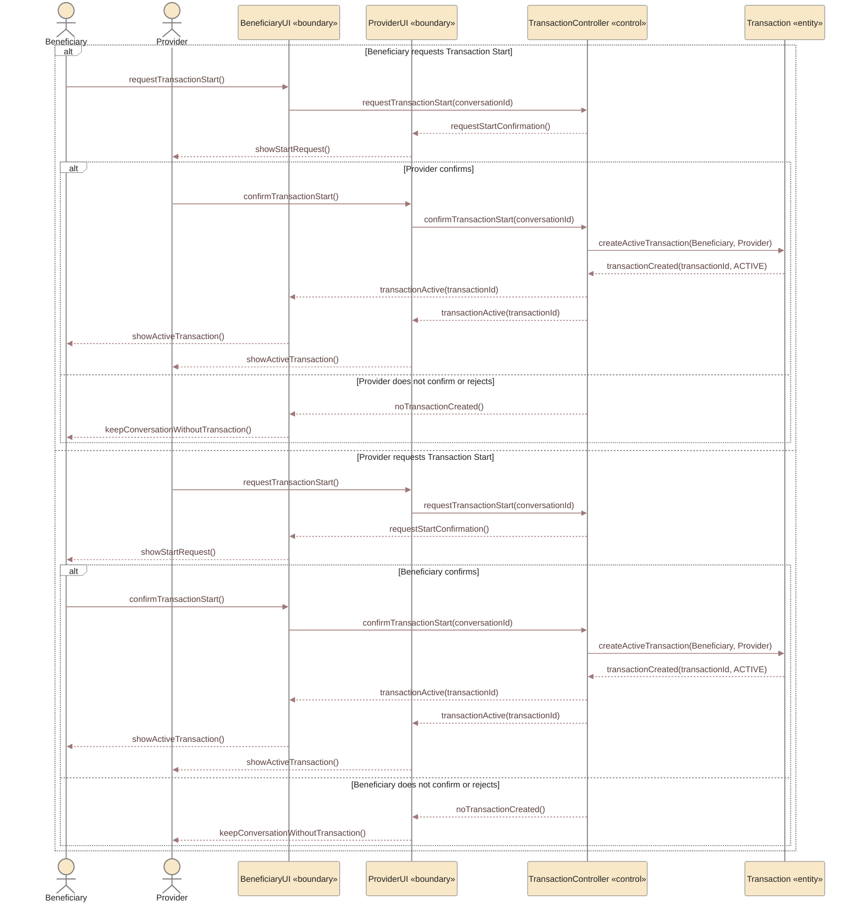

# UC-01 — Search and Inquire Directly Sequence Diagrams

> **Status:** `REVIEW DRAFT — NOT BASELINED`
>
> **Purpose:** Sequence modeling مشتق من `UC-01 — Search and Inquire Directly` فقط. تم تقسيم الـUse Case إلى سيناريوهين مترابطين حتى تبقى كل Sequence Diagram واضحة وقابلة للعرض على A4 بدل دمج البحث والمحادثة وبدء Transaction في رسم واحد مزدحم.

## Source basis

- **Approved behavior:** `UC-01 — Search and Inquire Directly` in `docs/03-analysis/08-use-cases.md`.
- **Decision/business basis:** `DEC-012`, `DEC-031..033`, `DEC-046`, `DEC-047`, `DEC-064`, `DEC-066`, `DEC-069` and the corresponding current business rules.
- **Core rule:** Chat alone never creates a Transaction.
- **Direct-search start rule:** either party may request Transaction Start, but `Active Transaction` is created only after the other party confirms.
- **Alternative:** no confirmation or rejection leaves the conversation without a Transaction.
- **Derived modeling roles:** `BeneficiaryUI`, `ProviderUI`, `DiscoveryController`, `CommunicationController`, and `TransactionController` are Sequence modeling roles, not approved implementation class names.

---

## Scenario A — Search, View Profile, and Inquire

### Scenario A postcondition

- Beneficiary may have viewed a Provider Profile and Portfolio/Catalog.
- A private Conversation may exist or continue.
- No Transaction is created merely because Chat occurred.

---

## Scenario B — Request and Confirm Transaction Start

> **Precondition:** a valid direct-search Conversation/context already exists between the same Beneficiary and Provider.

### Scenario B postconditions

If the other party confirms:

- one `Active Transaction` is created between the Beneficiary and Provider.

If the other party does not confirm or rejects:

- no Transaction is created.
- the Conversation may continue or end.

---

## Scope boundary

UC-01 ends when either:

- the parties remain in direct inquiry/chat without a Transaction, or
- the other party confirms Transaction Start and YADD creates an `Active Transaction`.

The diagrams intentionally do not include Cancellation, Final Invoice, Complaint, Completion, or Ratings. Those are later Use Cases/Scenarios and must not be folded into UC-01.

## Modeling note

The two diagrams above are a **scenario decomposition of one approved Use Case**, not two new Use Cases. This is a presentation/modeling choice intended to preserve readability and A4 print quality without changing project scope or requirements.
