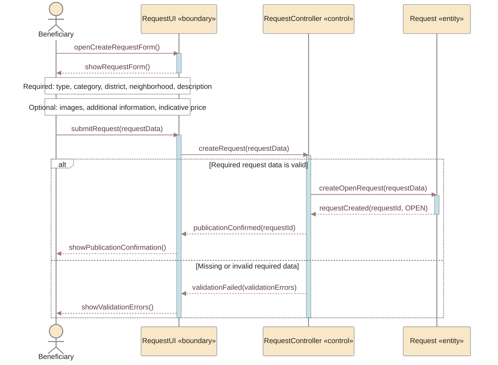

# UC-02 — Create Request Sequence Diagram

> **Status:** `REVIEW DRAFT — NOT BASELINED`
>
> **Purpose:** Sequence Diagram مشتق من `UC-02 — Create Request` فقط، وليس من Published Request Route بالكامل. صُمم ليكون صغيرًا وقابلًا للعرض على A4.

## Source basis

- **Approved behavior:** `UC-02 — Create Request` in `docs/03-analysis/08-use-cases.md`.
- **Requirements:** `FR-005`, `FR-005A`, `FR-005B` in `docs/03-analysis/05-SRS.md`.
- **Business/decision basis:** `DEC-012`, `DEC-013` and the corresponding current business rules.
- **Derived modeling roles:** `RequestUI` and `RequestController` are modeling roles for the Sequence Diagram; they are not approved implementation class names.
- **Derived error behavior:** generic validation failure is shown only as `Missing or invalid required data`. No unapproved numeric limits or validation thresholds are invented.

## Diagram

## Scope boundary

هذا المخطط **ينتهي عند نجاح نشر Request بحالة `Open`**.

لا يتضمن عمدًا:

- `Close Open Request` لأنه إجراء لاحق مستقل زمنيًا عن إنشاء الطلب.
- عرض الطلب على Providers أو `Provider Response`؛ هذه تخص السيناريو/Use Case التالي.
- Request expiry/reminder timing لأن التفاصيل الرقمية ما تزال `Needs Verification / Proposed`.
- Transaction, Invoice, Complaint, أو Ratings لأنها خارج UC-02.

## Postcondition

عند نجاح السيناريو:

`Request.status = Open`

وعند فشل التحقق العام لا يتم إنشاء Request جديدة حتى يصحح Beneficiary البيانات المطلوبة.
