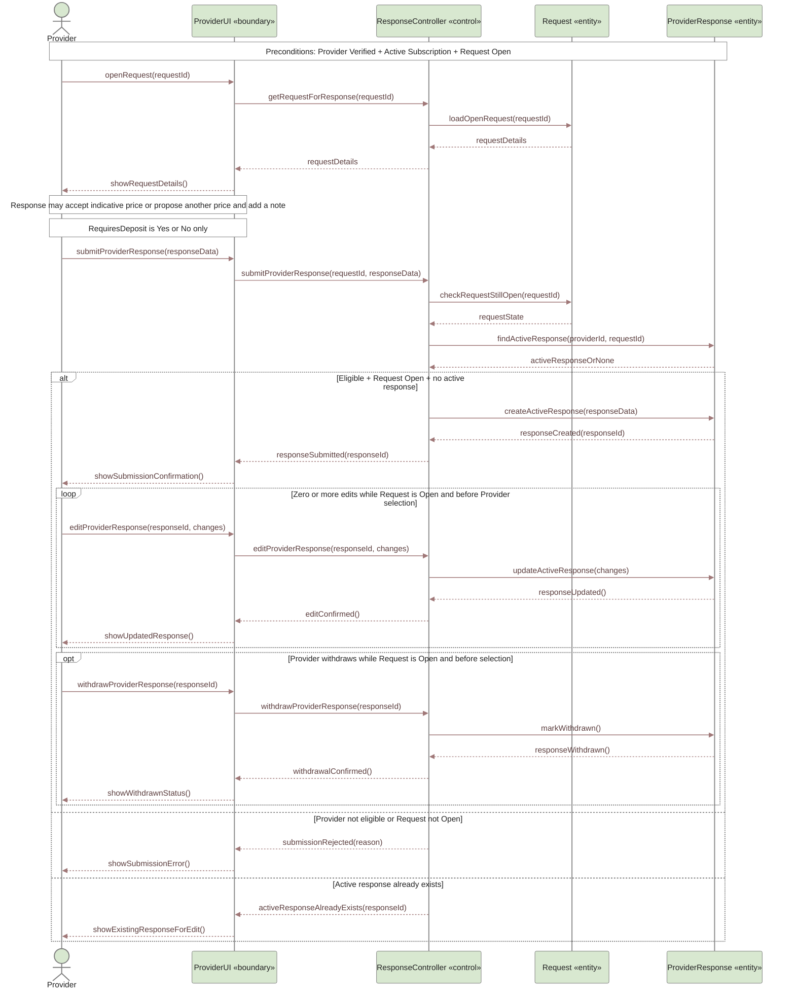

# UC-03 — Respond to Request Sequence Diagram

> **Status:** `REVIEW DRAFT — NOT BASELINED`
>
> **Purpose:** Sequence Diagram مشتق من `UC-03 — Respond to Request` فقط. لا يمثل رحلة Published Request كاملة.

## Source basis

- **Approved behavior:** `UC-03 — Respond to Request` in `docs/03-analysis/08-use-cases.md`.
- **Business/decision basis:** `DEC-013`, `DEC-041`, `DEC-043`, `DEC-047`, `DEC-066`, `DEC-070` and the corresponding current business rules.
- **Preconditions:** Provider Verified + subscription Active + Request `Open`.
- **Business constraint:** one active Provider Response per Provider per Request.
- **Derived modeling roles:** `ProviderUI` and `ResponseController` are Sequence modeling roles; they are not approved implementation class names.

## Diagram

## Scope boundary

هذا المخطط يركز على استجابة Provider للطلب فقط.

لا يتضمن عمدًا:

- إنشاء Request؛ هذا مغطى في `UC-02 — Create Request`.
- مقارنة Beneficiary للاستجابات أو اختيار Provider؛ هذه تخص `UC-04 — Select Provider from Request`.
- Chat قبل الاختيار؛ رغم أنه مسموح في UC-03، فهو تفاعل مستقل بين Actorين وسيُمثل في Sequence خاص بالتواصل حتى لا يتضخم هذا الرسم.
- إنشاء Transaction؛ في Published Request Route يبدأ ذلك عند اختيار Provider، وليس عند مجرد إرسال Provider Response.
- أي DepositAmount أو Payment/Refund flow؛ `RequiresDeposit` مجرد Yes/No داخل Provider Response.

## Postconditions

عند نجاح الإرسال:

- توجد Provider Response فعالة واحدة فقط لهذا Provider على هذا Request.
- تبقى قابلة للتعديل أو السحب ما دام Request `Open` وقبل Provider selection.

عند سحب الاستجابة:

- لا تبقى الاستجابة Active.
