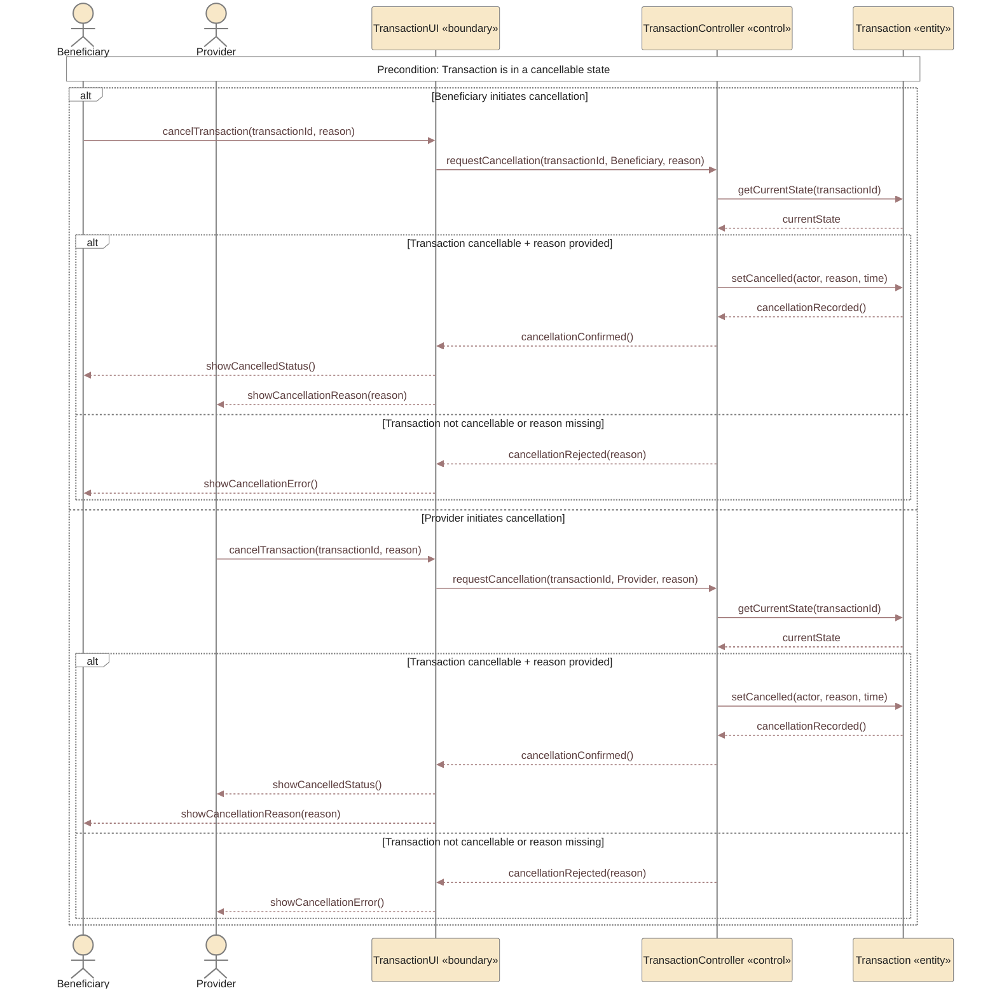

# UC-05 — Cancel Active Transaction Sequence Diagram

> **Status:** `REVIEW DRAFT — NOT BASELINED`
>
> **Purpose:** Sequence Diagram مشتق من `UC-05 — Cancel Active Transaction` فقط. يوضح إلغاء Transaction بعد أن تكون قد بدأت رسميًا، ولا يخلط ذلك مع إغلاق Request قبل الاختيار.

## Source basis

- **Approved behavior:** `UC-05 — Cancel Active Transaction` in `docs/03-analysis/08-use-cases.md`.
- **Business rule:** `BR-019` — after Transaction start, cancellation requires a recorded reason shown to the other party and reviewable administratively.
- **Lifecycle:** current Transaction lifecycle allows `Active → Cancelled` with a recorded reason.
- **Related decisions:** `DEC-048`, `DEC-054`.
- **Derived modeling roles:** `TransactionUI` and `TransactionController` are Sequence modeling roles; they are not approved implementation class names.
- **Derived consistency/error behavior:** the current Transaction state is checked at execution time before cancellation is committed.

## Diagram

## Scope boundary

هذا المخطط يركز على Transaction Cancellation فقط.

لا يتضمن عمدًا:

- `Close Open Request`؛ هذا يحدث قبل اختيار Provider وهو Request Closure وليس Transaction Cancellation.
- أي Deposit/Payment/Refund flow؛ هذه خارج YADD وفق النموذج الحالي.
- Administrative review التفصيلية؛ إمكانية مراجعة النمط موجودة كقاعدة، لكن المراجعة نفسها Interaction إداري لاحق وليست جزءًا إلزاميًا من كل عملية إلغاء.
- Invoice أو Ratings؛ `Cancelled` حالة نهائية غير ناجحة ولا تفتح Ratings.

## Postconditions

عند نجاح الإلغاء:

- `Transaction.status = Cancelled`.
- يسجل YADD الطرف الذي ألغى والسبب والتوقيت.
- يظهر سبب الإلغاء للطرف الآخر.

عند رفض الإلغاء:

- لا تتغير حالة Transaction.

## Modeling note

فرع `Transaction not cancellable or reason missing` يمثل حماية تنفيذية مشتقة من الـprecondition ومن إلزامية السبب. لم تُخترع أي مهلة زمنية أو سياسة مالية أو threshold إضافي.
