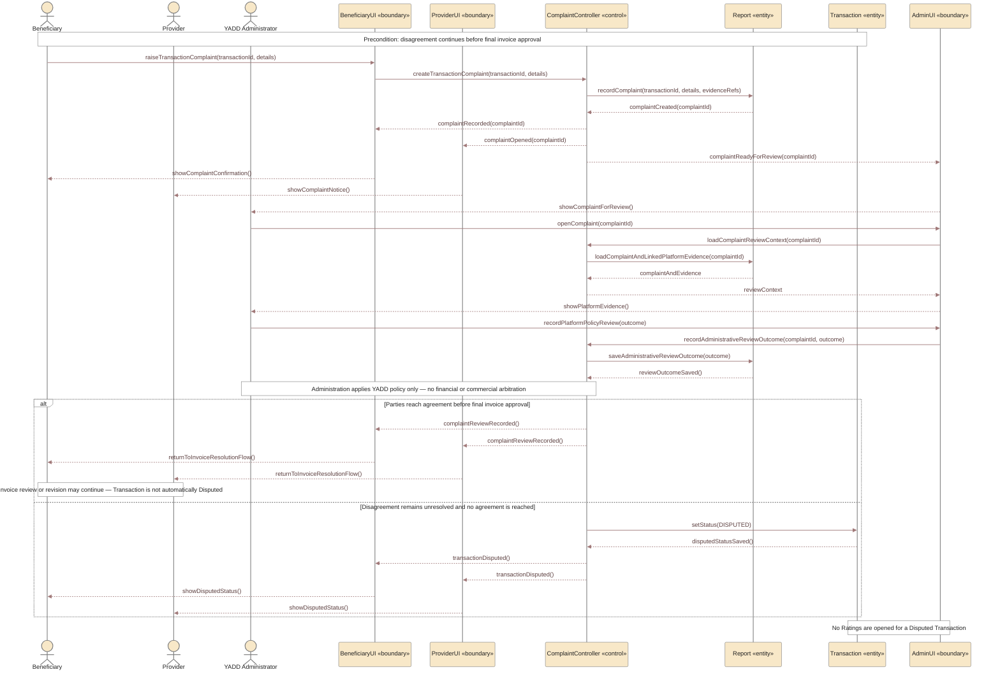

# UC-06 — Transaction Complaint / Administrative Review Sequence Diagram

> **Status:** `REVIEW DRAFT — NOT BASELINED`
>
> **Purpose:** Sequence Diagram مشتق من **Alternative — Dispute** داخل `UC-06 — Create, Revise and Approve Final Invoice`. هذا الملف لا ينشئ Use Case جديدة؛ هو Scenario منفصل لأن مسار الشكوى والمراجعة الإدارية معقد بما يكفي ليكون رسمًا مستقلًا وقابلًا للعرض على A4.

## Source basis

- **Approved behavior:** dispute alternative in `UC-06` from `docs/03-analysis/08-use-cases.md`.
- **Team decision:** `DEC-073`.
- **Business rule:** `BR-040`.
- **Detailed model:** `docs/03-analysis/15-invoice-approval-and-dispute.md`.
- **Precondition:** disagreement continues before final invoice approval.
- **Governance rule:** YADD Administration reviews evidence available inside YADD and applies platform policy only. It does not arbitrate financial/commercial rights and does not order Payment, Refund, or Compensation.
- **Terminal rule:** Transaction becomes `Disputed` only when the disagreement remains unresolved and the parties do not reach agreement before invoice approval.
- **Rating rule:** `Disputed` Transactions do not open Ratings.
- **Derived modeling roles:** `BeneficiaryUI`, `ProviderUI`, `AdminUI`, and `ComplaintController` are Sequence modeling roles, not approved implementation class names.

## Diagram

## Scope boundary

هذا الرسم يبدأ فقط بعد استمرار الخلاف قبل اعتماد Final Invoice. لا يعيد رسم إنشاء الفاتورة أو طلب التعديل، لأنهما موجودان في `uc-06-final-invoice-sequence.md`.

لا يتضمن عمدًا:

- أي Payment, Refund, Compensation, Escrow, أو Settlement داخل YADD.
- أي ادعاء بأن قرار الإدارة يحسم الحقوق التجارية بين Beneficiary وProvider.
- أي automatic punishment بمجرد تقديم Complaint.
- تفاصيل قائمة العقوبات أو سياسة moderation الدقيقة إذا لم تكن معتمدة.

## Postconditions

### If parties reach agreement

- يسجل Administrative Review Outcome داخل YADD.
- لا تتحول Transaction تلقائيًا إلى `Disputed`.
- يمكن العودة إلى مسار مراجعة/تعديل الفاتورة وفق الحالة الفعلية.

### If disagreement remains unresolved

- `Transaction.status = Disputed`.
- الحالة نهائية غير ناجحة.
- لا تفتح Ratings.

## Modeling note

استخدام `Report «entity»` هنا يتبع Traceability الحالية التي تمثل Transaction Complaint كسجل Report/complaint record. أما `ComplaintController` فهو Derived interaction role فقط.
