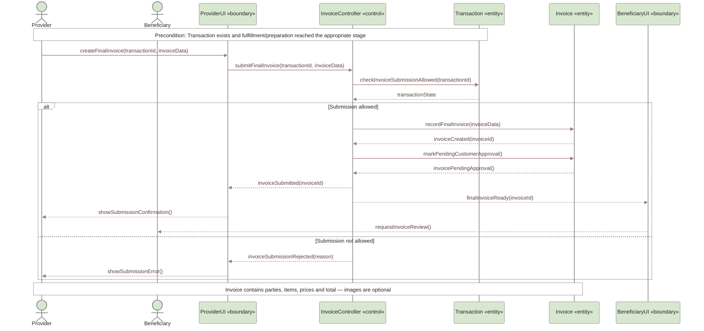
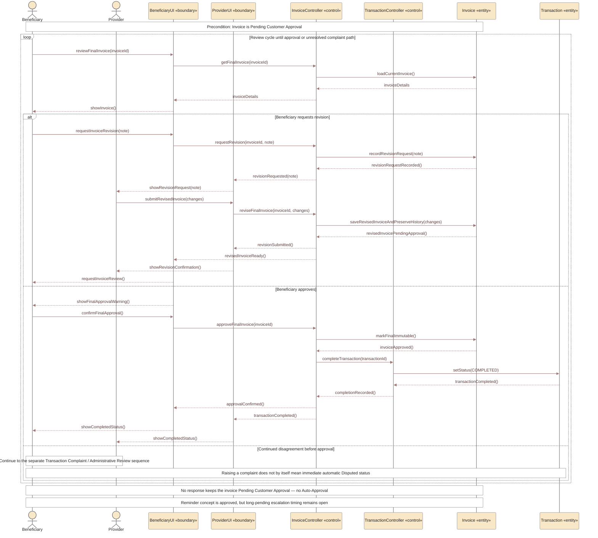

# UC-06 — Create, Revise and Approve Final Invoice Sequence Diagrams

> **Status:** `REVIEW DRAFT — NOT BASELINED`
>
> **Purpose:** تم تفكيك `UC-06 — Create, Revise and Approve Final Invoice` إلى سيناريوهين متماسكين بدل وضع دورة الفاتورة كاملة في Sequence Diagram واحدة كبيرة. هذا **Scenario Decomposition** داخل UC-06 وليس إنشاء Use Cases جديدة.

## Source basis

- **Approved behavior:** `UC-06 — Create, Revise and Approve Final Invoice` in `docs/03-analysis/08-use-cases.md`.
- **Requirements:** `FR-010`, `FR-010A`, `FR-011`, `FR-011A`, `FR-011B`, `FR-011C`, `FR-011D`, and the current completion requirement in `docs/03-analysis/05-SRS.md`.
- **Business rules:** `BR-009` through `BR-013`, plus the current dispute/completion rules.
- **Lifecycle:** Final Invoice is sent as `Pending Customer Approval`; approval makes Transaction `Completed`; revision returns the invoice to Provider and then back for review; no response is not approval and there is no Auto-Approval.
- **Detailed model:** `docs/03-analysis/15-invoice-approval-and-dispute.md`.
- **Derived modeling roles:** `ProviderUI`, `BeneficiaryUI`, `InvoiceController`, and `TransactionController` are Sequence modeling roles, not approved implementation class names.
- **Abstraction rule:** this draft does **not** commit to an `InvoiceVersion` implementation class. The requirement to preserve revision history is represented abstractly on `Invoice`.

---

## Scenario A — Provider Creates and Submits Final Invoice

### Scenario A postcondition

عند نجاح الإرسال تصبح الفاتورة `Pending Customer Approval`. لا يعني ذلك أن Transaction اكتملت، ولا يثبت أي Payment داخل YADD.

---

## Scenario B — Beneficiary Reviews, Requests Revision, or Approves

## Scope boundary

UC-06 ينتهي في المسار الناجح عند:

`Final Invoice Approved → Transaction = Completed`

ولا يتضمن عمدًا تفاصيل التقييم؛ `Rate Provider` و`Rate Beneficiary` هما Post-Transaction Use Cases مستقلة.

المسار التفصيلي للشكوى والمراجعة الإدارية **لم يُحشر داخل هذا الرسم** حتى لا يتضخم UC-06، وسيُمثل في Sequence Diagram مستقلة للـTransaction Complaint / Administrative Review. عندها يجب الحفاظ على `DEC-073`: الإدارة تراجع أدلة YADD وتطبق سياسة المنصة، ولا تحكم في الدفع/الاسترداد/التعويض، و`Disputed` لا يُعامل كأثر آلي فوري لمجرد فتح Complaint.

## Approved behavior represented here

- Provider creates the final invoice after fulfillment/preparation and stabilized final terms.
- Invoice is sent as `Pending Customer Approval`.
- Beneficiary may request revision with a note.
- Provider may revise and resubmit, and previous revisions must remain traceable.
- Before final approval, Beneficiary sees a clear warning and confirms separately.
- Approved invoice becomes final/immutable inside YADD.
- Invoice approval makes the Transaction `Completed`.
- No response does not equal approval; there is no Auto-Approval.
- No Payment/Refund lifecycle is modeled inside YADD.

## Needs Verification / intentionally omitted

`INV-PENDING-Q01` remains open, so this diagram does not invent a duration, reminder count, or automatic escalation rule for a long-pending invoice.
