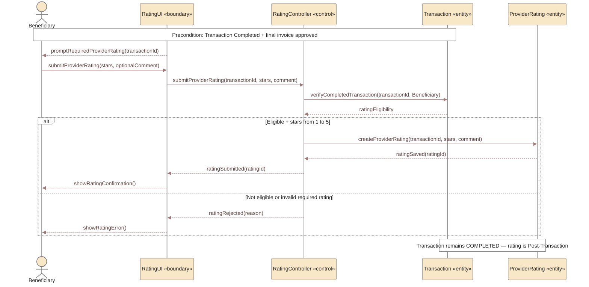

# UC-07 — Rate Provider Sequence Diagram

> **Status:** `REVIEW DRAFT — NOT BASELINED`
>
> **Purpose:** Sequence Diagram مشتق من `UC-07 — Rate Provider` فقط. يمثل التقييم الإلزامي للمقدم بعد اكتمال Transaction، باعتباره Post-Transaction operation مستقلة.

## Source basis

- **Approved behavior:** `UC-07 — Rate Provider` in `docs/03-analysis/08-use-cases.md`.
- **Rating model:** `docs/03-analysis/18-rating-reputation-model.md`.
- **Business/decision basis:** `DEC-051`, `DEC-071` and the corresponding rating/business rules.
- **Precondition:** Transaction is `Completed` between the same Beneficiary and Provider, with the final invoice approved.
- **Rating data:** 1–5 stars are required; text comment is optional.
- **State rule:** submitting the rating does not change Transaction status; it remains `Completed`.
- **Derived modeling roles:** `RatingUI` and `RatingController` are Sequence modeling roles, not approved implementation class names.

## Diagram

## Scope boundary

هذا المخطط يركز فقط على `Beneficiary → Provider` rating.

لا يتضمن عمدًا:

- Invoice approval flow؛ هو precondition وتم تمثيله في UC-06.
- Provider rating of Beneficiary؛ مغطى في `UC-07B` منفصلة.
- أي انتقال إلى Transaction state باسم `Closed`؛ لا توجد هذه الحالة في النموذج الحالي.
- تفاصيل Content Moderation للتعليق؛ التعليق يخضع لسياسة المحتوى، لكن المراجعة الإدارية ليست خطوة إلزامية في كل Rating.

## Postconditions

عند نجاح الإرسال:

- ترتبط Provider Rating بالـCompleted Transaction نفسها.
- تحفظ درجة 1–5، والتعليق إن أضيف.
- تبقى `Transaction.status = Completed`.

## Modeling note

فرع رفض التقييم يمثل حماية تنفيذية مشتقة من شروط الأهلية ومن إلزامية قيمة النجوم 1–5. لا يضيف عقوبة أو حالة Transaction جديدة.
