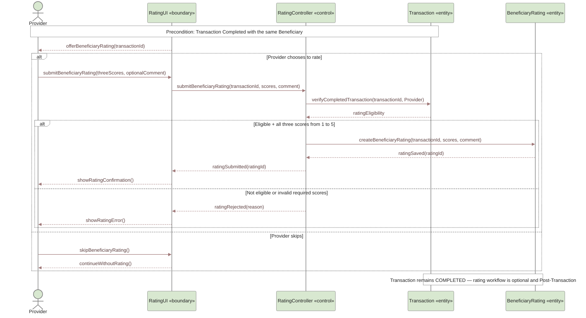

# UC-07B — Provider Rates Beneficiary Sequence Diagram

> **Status:** `REVIEW DRAFT — NOT BASELINED`
>
> **Purpose:** Sequence Diagram مشتق من `UC-07B — Provider Rates Beneficiary` فقط. يمثل التقييم الاختياري للمستفيد بعد اكتمال Transaction، باعتباره Post-Transaction operation مستقلة.

## Source basis

- **Approved behavior:** `UC-07B — Provider Rates Beneficiary` in `docs/03-analysis/08-use-cases.md`.
- **Rating model:** `docs/03-analysis/18-rating-reputation-model.md`.
- **Business/decision basis:** `DEC-063`, `DEC-071` and the corresponding rating/business rules.
- **Precondition:** Transaction is `Completed` between the same Provider and Beneficiary.
- **Rating data:** three behavioral indicators are required if Provider chooses to rate, each from 1 to 5; text comment is optional.
- **Optionality:** Provider may skip the rating.
- **Visibility/consequence rule:** the resulting Beneficiary interaction record has limited visibility to Providers in a legitimate interaction context and causes no automatic penalty in MVP.
- **State rule:** submitting or skipping the rating does not change Transaction status; it remains `Completed`.
- **Derived modeling roles:** `RatingUI` and `RatingController` are Sequence modeling roles, not approved implementation class names.

## Diagram

## Scope boundary

هذا المخطط يركز فقط على `Provider → Beneficiary` rating.

لا يتضمن عمدًا:

- Beneficiary rating of Provider؛ مغطى في `UC-07` منفصلة.
- أي Transaction state جديدة بعد التقييم أو التخطي.
- عقوبة أو تعليقًا آليًا للمستفيد بناءً على التقييم؛ ذلك غير موجود في MVP الحالي.
- تفاصيل حساب المتوسطات أو خوارزمية السمعة؛ الوثيقة الحالية تعتمد سجل تعامل محدود الظهور ولا تفرض صيغة حسابية جديدة هنا.

## Postconditions

إذا اختار Provider التقييم ونجح الإرسال:

- ترتبط Beneficiary Rating بالـCompleted Transaction نفسها.
- تحفظ المؤشرات الثلاثة 1–5 والتعليق إن أضيف.
- تصبح مساهمة في سجل تعامل Beneficiary محدود الظهور وفق القواعد الحالية.
- تبقى `Transaction.status = Completed`.

إذا اختار Provider التخطي:

- لا تنشأ Rating.
- تبقى `Transaction.status = Completed` دون أثر إضافي.

## Modeling note

فرع التحقق من Completed Transaction وقيم 1–5 هو حماية تنفيذية مشتقة من شروط الأهلية والحقول المعتمدة، وليس Policy جديدة أو عقوبة آلية.
