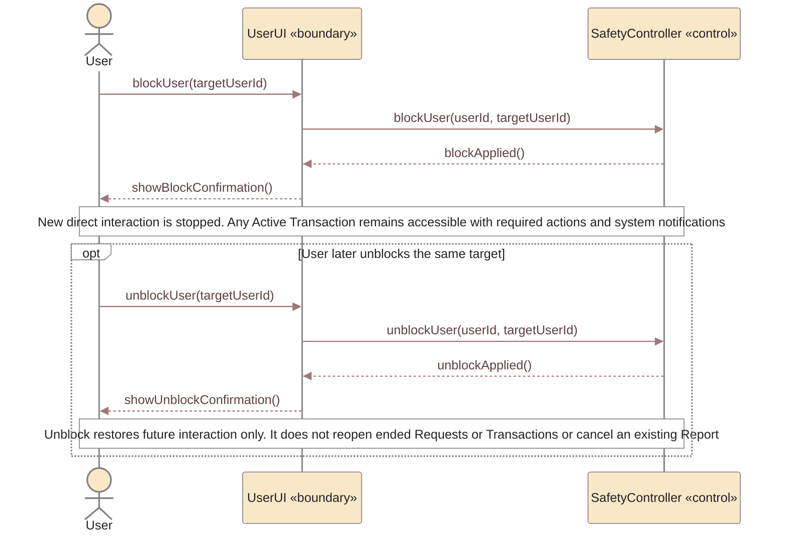
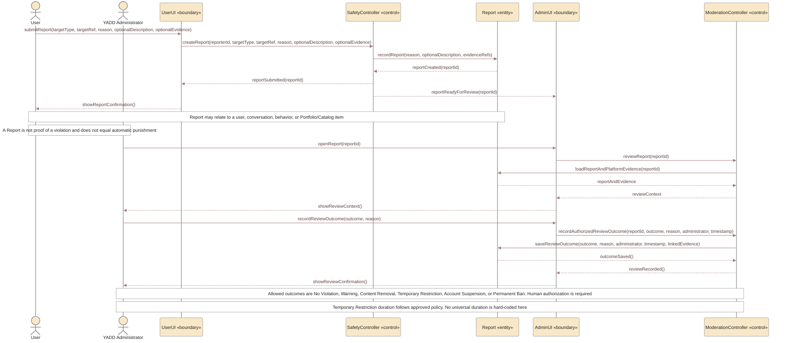

# UC-08 — Block and Report User / Content Sequence Diagrams

> **Status:** `REVIEW DRAFT — SYNCHRONIZED 2026-09-18 — NOT BASELINED`
>
> **Purpose:** تم تفكيك `UC-08 — Block and Report User / Content` إلى سيناريوهين مستقلين داخل الملف نفسه لأن `Block User` و`Report User / Content` هدفان منفصلان للمستخدم، ولا يشترط أحدهما الآخر. هذا متوافق مع Traceability الحالية ولا ينشئ Use Cases جديدة.

## Source basis

- **Approved behavior:** `UC-08 — Block and Report User / Content` in `docs/03-analysis/08-use-cases.md`.
- **Team decisions:** `DEC-053`, `DEC-054`, `DEC-088`, `DEC-089`.
- **Business rules:** `BR-021`, `BR-022`, `BR-065`, `BR-066`.
- **Traceability:** `UR-SAFE-01` maps to `UC-08 → Block User / Report User-Content / Review Reports-Flags` and to `REPORT / moderation records`.
- **Trust & Safety rule:** Report and AI/behavioral Flags are inputs for review and do not by themselves prove a violation or authorize an automatic final high-impact punishment.
- **Report input synchronization:** generic Report requires a `Reason`; generic Description remains policy-dependent and is not silently made mandatory. Optional supporting evidence may be attached when the context supports it.
- **Open items intentionally excluded:** AI/moderation thresholds, detailed policy categories, appeal flow, and a universal Temporary Restriction duration remain open and are not invented here.
- **Derived modeling roles:** `UserUI`, `SafetyController`, `AdminUI`, and `ModerationController` are Sequence modeling roles, not approved implementation class names.

### Actor note

`User` هنا هو الـPrimary actor كما هو مكتوب في UC-08، ويعني شخصًا يستخدم YADD في سياق Beneficiary أو Provider. لا يمثل هذا إضافة Actor رئيسي جديد إلى Main Use Case Diagram، الذي يبقى وفق النموذج الحالي: `Beneficiary`, `Provider`, `YADD Administrator`.

---

## Scenario A — Block User

### Scenario A postcondition

- يتوقف التواصل والتعامل الجديد بين المستخدمين، لكن Active Transaction القائمة وإجراءاتها الأساسية وإشعارات النظام تبقى متاحة.
- يمكن لصاحب الحظر تنفيذ Unblock لاحقًا؛ Unblock لا يعيد Request/Transaction منتهية ولا يلغي Report سابقًا.
- لا يعني `Block` تلقائيًا وجود Report ولا يمثل إدانة.

---

## Scenario B — Report User / Content and Administrative Review

## Scope boundary

هذا الملف لا يجعل `Block` شرطًا لرفع `Report` ولا يجعل `Report` شرطًا لتنفيذ `Block`.

كما لا يتضمن عمدًا:

- AI كخطوة إلزامية في كل Report؛ AI/Rules قد تولد Flags في Trust & Safety، لكن UC-08 لا تشترط أن يمر كل Report عبر AI.
- أي threshold رقمي أو Risk Score محدد؛ هذه تفاصيل `Needs Verification`.
- فئات المخالفات والـthresholds التفصيلية ما تزال مفتوحة؛ أما قائمة نتائج المراجعة الإدارية الأساسية فمعتمدة في DEC-089.
- أي عقوبة نهائية آلية بمجرد Report أو Flag.

## Postconditions

### Block

- يتوقف التواصل/التعامل الجديد بين المستخدمين المعنيين، مع بقاء Active Transaction القائمة وإجراءاتها النظامية عند وجودها.
- Unblock يعيد التفاعل المستقبلي فقط ولا يلغي Report سابقًا أو يعيد كيانًا منتهيًا.

### Report

- يتم حفظ Report كسجل قابل للمراجعة الإدارية.
- يراجع موظف مخول Report والأدلة المتاحة داخل YADD.
- يسجل Review Outcome وسببه والموظف والتوقيت والبلاغ/الدليل المرتبط وفق DEC-089.
- Report وحده لا يساوي إدانة، ولا يؤدي تلقائيًا إلى حظر نهائي أو عقوبة عالية الأثر.

## Modeling note

استخدام `Report «entity»` مدعوم بالـTraceability الحالية (`REPORT / moderation records`). أما أسماء الـUI والـControllers فهي Derived interaction roles فقط، ولا تمثل قرارًا معماريًا أو Classes تنفيذية معتمدة.
