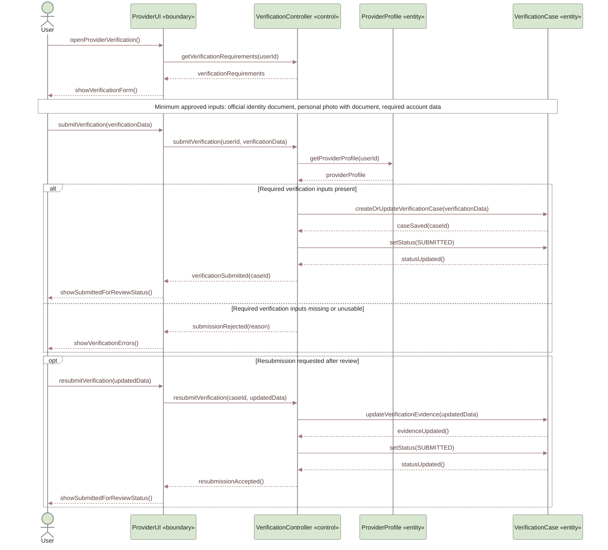
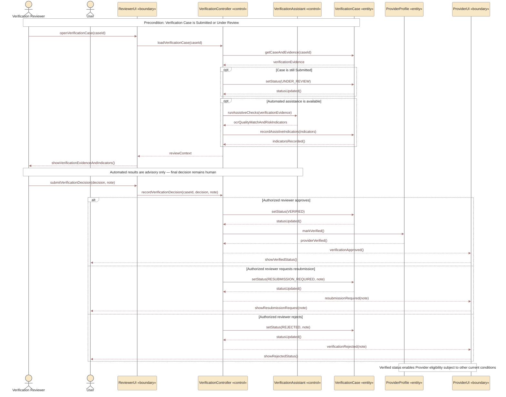

# UC-09 — Provider Verification / Portal Activation Sequence Diagrams

> **Status:** `REVIEW DRAFT — NOT BASELINED`
>
> **Purpose:** تم تفكيك `UC-09 — Provider Verification / Portal Activation` إلى سيناريوهين متماسكين داخل الملف نفسه حتى يبقى الرسم قابلًا للقراءة على A4: تقديم/إعادة تقديم التحقق، ثم المراجعة البشرية والقرار. هذا Scenario Decomposition داخل UC-09 ولا ينشئ Use Cases جديدة.

## Source basis

- **Approved behavior:** `UC-09 — Provider Verification / Portal Activation` in `docs/03-analysis/08-use-cases.md`.
- **Provider Verification Model:** `docs/03-analysis/21-provider-verification-model.md`.
- **Team decisions:** `DEC-010`, `DEC-034`, `DEC-035`, `DEC-036`, `DEC-037..040`.
- **Business rules:** `BR-027`, `BR-028` and the current verification rules.
- **Core verification rule:** every Provider Profile must pass formal verification before Provider functions become available.
- **Minimum approved evidence:** official identity document + a personal photo with the document + required account data for matching.
- **Human decision rule:** final `Verified`, `Resubmission Required`, or `Rejected` decision is made by authorized YADD staff. AI/automated checks are advisory only.
- **Sensitive-data rule:** identity images, personal verification photos, matching results and related verification data are non-public and access-controlled.
- **Derived modeling roles:** `ProviderUI`, `VerificationController`, `VerificationAssistant`, and `ReviewerUI` are Sequence modeling roles only, not approved implementation class names or committed services.

## Scenario A — Submit or Resubmit Verification

### Scenario A notes

- لا يتم تفعيل Provider Profile تلقائيًا بمجرد رفع البيانات.
- بعد الإرسال تكون الحالة المفاهيمية `Submitted`، وتنتقل إلى `UnderReview` عند بدء المراجعة البشرية وفق lifecycle المعتمد.
- أثناء انتظار المراجعة يمكن للحساب الاستمرار كمستفيد، لكن لا تُفتح وظائف Provider المعتمدة على التحقق.
- لم يُفترض نوع وثيقة محدد أو عدد صور أو مدة صلاحية تشغيلية لأن هذه التفاصيل ما تزال مفتوحة.

---

## Scenario B — Assisted Checks, Human Review, and Final Verification Decision

## Scope boundary

هذا الملف يوضح Verification وPortal eligibility فقط. لا يتضمن عمدًا:

- اشتراك Provider كجزء من قرار التحقق نفسه. `Verified` لا يعني تلقائيًا أن الاشتراك `Active`، وإرسال Provider Responses الجديدة ما يزال يحتاج الشرطين معًا وفق القواعد الحالية.
- نوع مزود AI أو OCR/Face/Liveness service بعينه. `VerificationAssistant` مجرد modeling role ولا يثبت اختيار Vendor أو API.
- أي قرار نهائي آلي بالقبول أو الرفض.
- وصولًا إلى قواعد بيانات حكومية أو سجل جنائي، لأن ذلك غير معتمد.
- أنواع وثائق محددة، مدة الاحتفاظ، أو تراخيص مهنية خاصة، لأنها ما تزال `Needs Verification`.
- عرض بيانات التحقق الحساسة لأي Beneficiary أو Provider آخر.
- تفاصيل إنشاء/تعديل Provider Profile والنشاط ومناطق الخدمة؛ هذه أهداف نمذجة مستقلة في Main Use Case decomposition، بينما هذا الملف يركز على Verification/Activation interaction نفسها.

## Postconditions

### Verified

- `VerificationCase.status = Verified`.
- يصبح Provider Profile متحققًا.
- يمكن فتح وظائف Provider المناسبة فقط مع استيفاء الشروط الأخرى ذات الصلة.

### Resubmission Required

- لا يصبح Provider Profile Verified.
- يتلقى المستخدم ملاحظة/سبب إعادة التقديم ويستطيع تقديم Evidence محدثة.

### Rejected

- لا يصبح Provider Profile Verified.
- يسجل القرار والملاحظة/السبب بواسطة الموظف المخول.

## Sensitive-data and governance note

صور الهوية والصور الشخصية ونتائج المطابقة وبيانات التحقق مواد حساسة غير عامة. الوصول والمراجعات الحساسة يجب أن تكون مقيّدة ومُسجلة في Audit Trail وفق نموذج التحقق الحالي. تفاصيل مدة الاحتفاظ والحذف ما تزال `NEEDS_LEGAL_VERIFICATION` ولا تُخترع في هذا الرسم.
