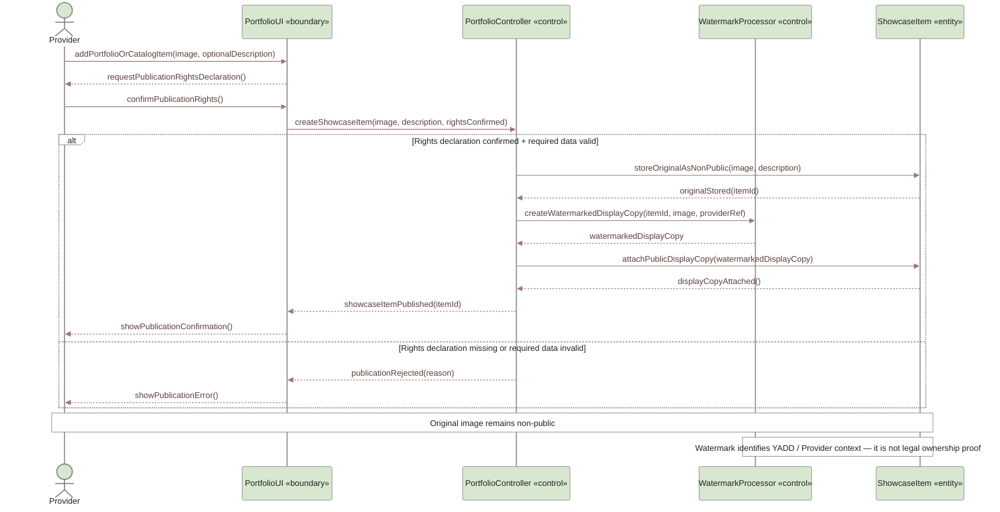

# UC-10 — Manage Portfolio / Catalog Sequence Diagram

> **Status:** `REVIEW DRAFT — NOT BASELINED`
>
> **Purpose:** Sequence Diagram مشتق من `UC-10 — Manage Portfolio / Catalog` فقط. يوضح إضافة عنصر Portfolio/Catalog وحفظ الأصل بصورة غير عامة وإنشاء نسخة عرض بعلامة مائية، دون خلط مسار البلاغ والمراجعة الإدارية الموجود أصلًا في UC-08.

## Source basis

- **Approved behavior:** `UC-10 — Manage Portfolio / Catalog` in `docs/03-analysis/08-use-cases.md`.
- **Team decision:** `DEC-064`.
- **Requirements:** `FR-PORT-01` through `FR-PORT-05` in `docs/03-analysis/05-SRS.md`.
- **Business rules:** `BR-035` and `BR-036`.
- **Traceability:** Portfolio/Catalog is represented by the current `SHOWCASE_ITEM` concept.
- **Rights rule:** Provider must declare the right to publish the uploaded content.
- **Storage/display rule:** the original image is kept non-public; YADD exposes a display copy carrying an identifying watermark associated with YADD and the Provider account.
- **Legal meaning:** the watermark is an identification/deterrence mechanism, not legal proof of ownership.
- **Derived modeling roles:** `PortfolioUI`, `PortfolioController`, and `WatermarkProcessor` are Sequence modeling roles only; they are not approved implementation class/service names.

## Diagram

## Scope boundary

هذا المخطط يركز فقط على إنشاء/نشر عنصر Portfolio أو Catalog داخل Provider Profile.

لا يتضمن عمدًا:

- `Report User / Content` أو Administrative Review؛ الإبلاغ عن عنصر مشتبه في انتحاله مسموح وفق UC-10 وFR-PORT-04، لكن Interaction البلاغ والمراجعة ممثل أصلًا في `UC-08 — Block and Report User / Content` لتجنب التكرار.
- AI/Content Moderation كخطوة إلزامية لكل رفع؛ نموذج Trust & Safety يسمح بالفحص عند الحاجة، لكن UC-10 لا يفرض مسار AI ثابتًا لكل عنصر.
- خوارزمية أو شكل العلامة المائية أو دقتها أو موضعها؛ هذه تفاصيل تصميم/تنفيذ لم تعتمد كمتطلب تحليلي.
- أي ادعاء بأن العلامة المائية تثبت الملكية القانونية.

## Postconditions

عند نجاح النشر:

- ينشأ `ShowcaseItem` مرتبط بـProvider Profile.
- يبقى الأصل غير عام.
- توجد نسخة عرض بعلامة مائية تعريفية مرتبطة بسياق YADD وحساب Provider.
- يظهر عنصر العرض داخل Provider Profile.

عند عدم وجود إقرار بحق النشر أو فشل البيانات المطلوبة:

- لا يتم نشر العنصر.

## Modeling note

استخدام `ShowcaseItem «entity»` مدعوم بالـTraceability الحالية. أما `WatermarkProcessor` فهو **Derived control role** لتمثيل السلوك المطلوب دون حسم مكتبة الصور أو خدمة التخزين أو آلية تنفيذ العلامة المائية.
