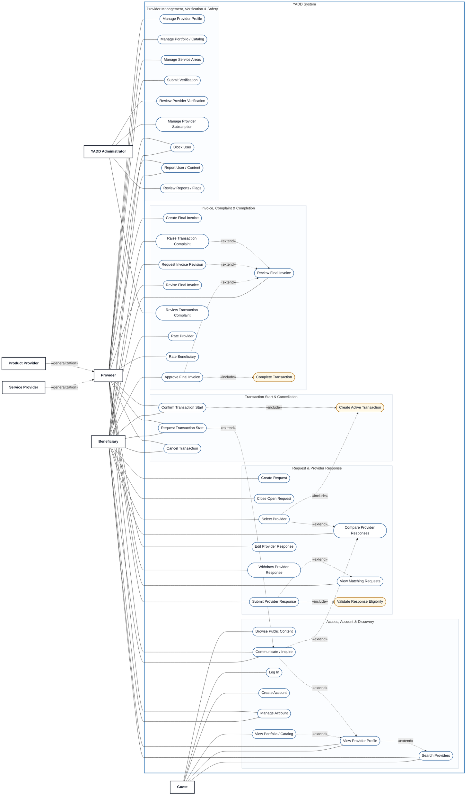

# Use Case View 00 — YADD Main Use Case Diagram

> **Status:** `REVIEW DRAFT — NOT BASELINED — DETAILED MAIN VIEW — SYNCHRONIZED THROUGH DEC-077`
>
> **Purpose:** Detailed main Actor–goal view of the single YADD Use Case Model. This file preserves the decomposed Main Diagram Use Cases and the approved/derived UML relationships currently documented in `08-use-cases.md`.
>
> **Presentation basis:** The team-supplied academic Use Case examples guide the presentation style only: Actors remain outside the system boundary, Actor associations are distinct from Use Case relationships, and `<<include>>`, `<<extend>>`, and Actor generalization are shown explicitly only where the YADD model supports them.

## Source basis

- `docs/00-governance/02-decision-register.md`
- `docs/03-analysis/05-SRS.md`
- `docs/03-analysis/06-business-rules.md`
- `docs/03-analysis/07-lifecycles.md`
- `docs/03-analysis/08-use-cases.md`
- `docs/03-analysis/10-UML.md`
- DEC-066..077, especially DEC-067/069/070/071/072/073/074/076/077.

## Diagram

## How to read this view

- Solid lines connect an external Actor to a Use Case that the Actor participates in.
- Dashed relationships labeled `«extend»` represent optional/conditional behavior that extends a base Use Case.
- Dashed relationships labeled `«include»` represent mandatory included behavior.
- Gold Use Cases are included system behavior and are **not independent Actor goals**.
- `Service Provider` and `Product Provider` are specializations of `Provider`. In MVP, one Provider Profile operates under exactly one of these two Provider Types at a time.

## Authentication boundary

`Log In` and `Create Account` are **not** mechanically included by every protected Use Case. Authentication is a precondition for protected Beneficiary/Provider goals. A Guest may see a protected CTA, but must authenticate before the protected action can be executed.

## Lifecycle / state dependencies that are intentionally not `include` or `extend`

| Use Case | Required dependency / precondition |
|---|---|
| `Rate Provider` | Transaction must already be `Completed`; the Beneficiary rating is then required by the current model. |
| `Rate Beneficiary` | Transaction must already be `Completed`; the Provider rating remains optional. |
| `Cancel Transaction` | Transaction exists and is in a cancellable active state. |
| `Close Open Request` | Request is `Open` and no Provider has been selected. |
| `Edit Provider Response` | An active response exists; Request remains `Open`; no Provider has been selected. |
| `Withdraw Provider Response` | An active response exists; Request remains `Open`; no Provider has been selected. |
| `Review Final Invoice` | Final Invoice is `Pending Customer Approval`. |
| `Revise Final Invoice` | Beneficiary previously requested an invoice revision. |
| `Review Provider Verification` | A verification submission exists. |
| `Review Transaction Complaint` | A Transaction complaint exists. |
| `Submit Provider Response` | Provider is Verified, Subscription is Active and Request is Open; the mandatory eligibility check is modeled by `Validate Response Eligibility`. |

## Coverage note

This is the **detailed Main Use Case View**. Views 01–04 do not define different models; they provide focused, easier-to-read views of the same Use Case elements and relationships for Public Access & Discovery, Request & Provider Response, Transaction/Invoice/Rating, and Provider Management/Verification/Safety.