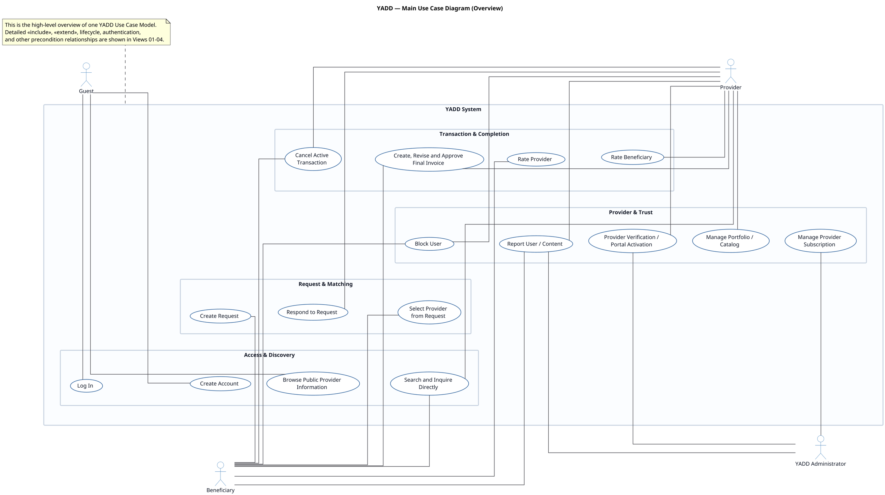
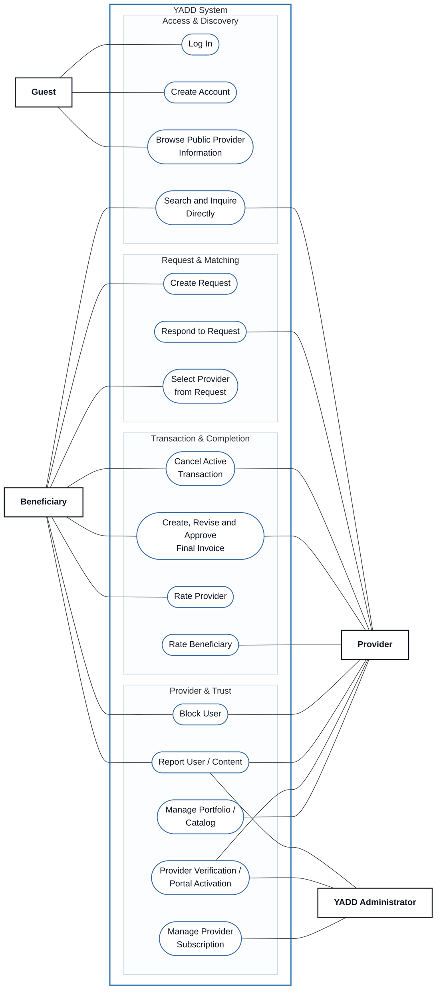

# Use Case View 00 — YADD Main Overview

> **Status:** `REVIEW DRAFT — NOT BASELINED — SYNCHRONIZED THROUGH DEC-077`
>
> **Purpose:** High-level overview of the single YADD Use Case Model. Detailed `<<include>>`, `<<extend>>`, lifecycle and precondition semantics are intentionally delegated to focused Views 01–04.
>
> **Presentation convention:** The PlantUML view follows the team-supplied academic Use Case reference style: external stick-figure Actors, one clear system boundary, oval Use Cases, solid Actor associations, and relationship stereotypes only where semantically justified. The reference controls presentation only; YADD semantics remain governed by the sources below.

## Source basis

- `docs/00-governance/02-decision-register.md`
- `docs/03-analysis/08-use-cases.md`
- `docs/03-analysis/10-UML.md`
- DEC-066..077, especially DEC-067/072/077.

## Academic Use Case Diagram — PlantUML

## Repository-readable interpretation — Mermaid

## Reading note

This overview answers only two questions: **Who interacts with YADD?** and **What major goals does each Actor have?** It intentionally avoids relationship-level detail so the diagram remains readable at repository and report scale.

The absence of `<<include>>` / `<<extend>>` in this overview is intentional, not missing data. Those approved relationships are displayed in the focused Views 01–04 where their context is clear and line crossing is manageable.

`Block User` and `Report User / Content` remain separate Use Cases because the current model explicitly treats blocking and reporting as independent concepts.
